# 第八节课 单体架构项目实战

## 🎗 前置知识

> 列举一些本节课相比于之前的课需要用到的一些新知识（组件）

**context (上下文)**


> 在web系统中，每次的网络请求都会创建一个协程或者线程去处理请求，在每一个请求中基本上都会另外开多个协程去请求对应的数据资源， 那如何的进行协程间的等停和数据传递呢，这里就用到了 **context** 了，也就是上下文对象，其实在大部分的语言中都没有 **context** 的概念。

[标准库 context 介绍](https://www.kancloud.cn/imdszxs/golang/1509625)

[标准库 context 原理分析](https://draveness.me/golang/docs/part3-runtime/ch06-concurrency/golang-context/)

[Gin 的上下文](https://juejin.cn/post/7034101056439058439)

**viper (配置管理)**


> 通常，在一个或多个项目中我们需要使用定义一些配置（数据库的配置，项目功能的参数配置），从而我们可以在项目的开发或上线过程中可以快速的自定义项目的一些功能，以便满足我们的一些特定需求，那么项目中的配置如何管理呢，在 Go 中我们需要用到叫做 **Viper** 配置管理器。

通常情况下，推荐使用viper库来读取配置文件， **viper 支持以下功能：**

- 支持 `yaml`、`json`、`toml`、`hcl` 等格式的配置文件
- 可以从`文件`、`io.Reader` 、`环境变量`、`cli命令行` 中读取配置
- 支持自动转换的类型解析
- 可以远程从Key/Value中读取配置，需要导入 viper/remote 包
- 监听配置文件。以往我们修改配置文件后需要重启服务生效，而Viper使用watch函数可以让配置自动生效。

[Go语言配置管理神器——Viper中文教程](https://www.liwenzhou.com/posts/Go/viper_tutorial/)

**zap (日志管理)**

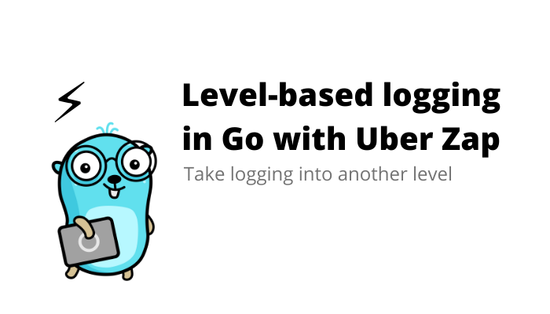

> 程序员的日常离不开日志，日志就好比私人秘书，负责运行周期一切 **trace** 工作。优秀的日志实践能极大帮助地程序员快速定位问题，减少在线错误报警。
>
> 在 Go 中我们用到 **zap** 作为日志记录器

[日志实践准则](http://www.yunweipai.com/23766.html)

[在Go语言项目中使用Zap日志库](https://www.liwenzhou.com/posts/Go/zap/)

[Zap 日志库实践](https://juejin.cn/post/7032091256457003044)

## 📄 前言

`Go 语言` 是一门简单、易学的编程语言。

- 对于**有编程经验的工程师**来说，学习并熟练掌握 ` Go 语言` 是手到擒来的事情，但是对于之前有过其他语言经验的开发者来说，写什么语言都像自己学过的语言其实是有问题的。想要真正融入 `Go 语言 `这个生态，并且能够写出优雅的代码就一定要花一些时间和精力**了解 Go 语言背后的设计哲学和最佳实践**。
- 对于**零基础的编程小白**来说，你学习 `Go 语言` 那更好，因为写 `Go 语言`的代码是很容易的，但是想要写出好的代码并不是一件容易的事情，它需要我们不断地对现有的代码进行反思 一件事情 — "**如何改写这段代码才能让它变得更加优雅**"

优雅听起来是一个非常感性、难以量化的结果，然而这却是好的代码能够带来的最直观感受，它可能隐式地包含了以下特性：

- 容易阅读和理解；
- 容易测试、维护和扩展；
- 命名清晰、无歧义、注释完善清楚；
- …

如何写出优雅的代码？

参考 [知乎](https://www.zhihu.com/question/28492982) 及 [编程的智慧](https://www.yinwang.org/blog-cn/2015/11/21/programming-philosophy)

## 🛠 代码规范


**代码规范**其实是一个老生常谈的问题，我们也不能免俗还是要简单介绍一下相关的内容，Go 语言比较常见并且使用广泛的代码规范就是官方提供的 [Go Code Review Comments](https://github.com/golang/go/wiki/CodeReviewComments)，无论你是短期还是长期使用 Go 语言编程，都应该**至少完整地阅读一遍这个官方的代码规范指南**，它既是我们在写代码时应该遵守的规则，也是在代码审查时需要注意的规范。

**学习 Go 语言相关的代码规范是一件非常重要的事情**，也是让我们的项目遵循统一规范的第一步，虽然阅读代码规范相关的文档非常重要，但是实际开发过程中不能保证所有人（包括自己）都能完成的遵循代码规范的，所以需要一个自动化工具来校验/限制不规范的代码。

**[golangci-lint](https://golangci-lint.run/)** 是一个绝大多数 go 开发者都熟悉的一个工具，可以校验任何 go 项目的代码规范，能够指出不规范的部分，并且支持指定开启/关闭部分类型的校验。

下面是一个写得很好的规范指南，一定要看，而且不能只过一遍就完了，要反复阅读，反复品味才行：

- [Go 语言编码规范](https://yusank.space/posts/go-standard/#%E4%BB%8B%E7%BB%8D)

## 📖 项目初识


在正式一个 Web 项目的开发之前，希望大家能够了解一些软件工程的知识，关于了解软件工程的重要性可以看看这一篇文章：[软件工程的最大难题](https://www.ruanyifeng.com/blog/2021/05/scaling-problem.html)


一个简单的 Web 系统需要有前端同学负责界面的开发，然后有后端的同学处理前端发送来的请求然后返回数据给前端（本节课讲到的项目不会考虑高并发等复杂的情况）。

我们先从一个 Web 请求出发，看看这个请求经历了哪些东西（主要介绍请求经历后端的处理流程）：


1. 用户在 Web 界面上**点击了一个按钮**，然后前端发起一个请求到后端

2. **请求到达后端**

    

    通常情况下，后端的工作就是解析前端的数据，处理对应的业务逻辑然后返回操作结果。

    在这里，离不开三层概念：

    - **API 层**：解析来自前端的数据，转化成 Go 的数据结构
    - **Service 层**：包含业务逻辑，将解析后的请求数据进一步处理
    - **Dao 层**：根据业务逻辑从数据库中存取数据，进行数据持久化

    当然，这三层逻辑并不绝对，会因为项目特点有所调整，但整体的**分层思路**是不会变化的。我认为，如果你能真正地理解web的分层，对项目的框架就能掌握得很棒了。

3. **API 层**

    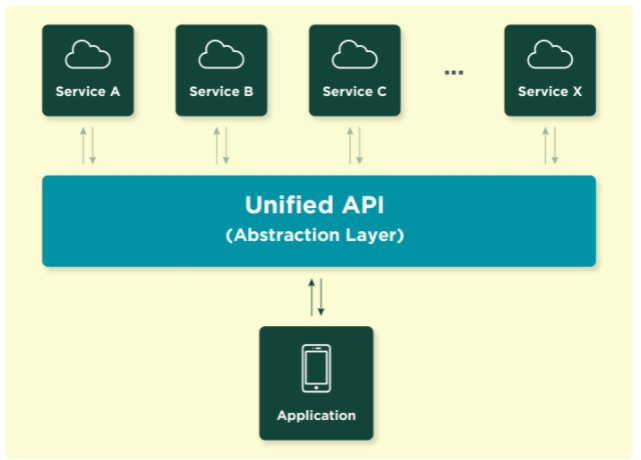

    通常来说，**API 层**只做三件事：

    - **根据路由规则，调用具体的处理函数**，常见的 `RESTful API`  就是由 `URL` + `Method` 作为路由规则
    - **解析` 文本` 或 `二进制数据` 到 Go 结构体**，创建的使用 `json` 或 `proto` 反序列化
    - **调用下一层 `Service` 的函数**

    在开发的过程中，我对 API 层的开发会重点关注以下几点：

    - **可读性**：可以快速地根据命名了解功能，如 `RESTful`，`函数命名`
    - **复用性**：引入各种中间件，如 `日志打印`，`recovery 中间件`，`用户认证中间件` 等
    - **简洁性**：不做或少做业务逻辑处理，复杂处理都丢到 `service` 层

    再强调一下API层的重要性：**API层是程序最关键的入口和出口，能很好地追踪到数据的前后变化情况。** 一个优秀的API层实现，不仅能让我们少写很多重复性代码，也能大幅度地降低我们排查问题的效率。

4. **Service 层**

    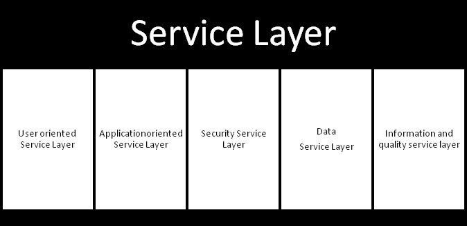

    Service 层可以理解为服务层，是整个项目中最复杂、也是代码比重往往是最多的。它是一个项目最核心的业务价值所在。

    Service是最灵活、也是最考验设计能力的，虽说**没有一套固定的模式**，但还是会有一定的**套路**。

    我分享一下个人的三个见解：

    1. 单元测试覆盖率要尽量高，这是一个**高频迭代与重构**的模块，也是最容易出现问题的部分；
    2. 深入实践 **面向[对象](https://zhuanlan.zhihu.com/p/75265007)与[DDD](https://developer.aliyun.com/article/863048)** ，最锻炼工程师抽象、解耦等能力的模块；
    3. 选择合适的 **[设计模式](http://lailin.xyz/post/go-design-pattern.html)** 可大幅度地提升研发效率；

    再提一句，Service层是和业务一起成长的，前期没必要过度设计。我们把重点放在-单元测试的编写上即可，适当地选用一些库来提高效率，如开源的 `stretchr/testify`，内部的 `reflect` 等。

5. **Dao 层**

    

    Dao层常被理解为数据持久化层，但我们可以将它进行一定的延伸：**将RPC调用也当做Dao层**（不妨认为将数据持久化到了另一个服务），来适配微服务架构的场景。

    > 严格意义上，RPC调用和普通的Dao差异有不少，但为了收敛话题，我们暂且不细分。

    今天，我们不关注分布式场景下的各种数据问题，也不考虑各种存储中间件的特点，而是聚焦于一个问题：**如何将内存中的对象持久化到数据库中**。在编程领域，这部分的工具被称为**ORM**。

    以Go语言对接MySQL为例，最常见的为 [Gorm](https://github.com/go-gorm/gorm)，它能很便捷地将一个Go语言中的结构体，映射到MySQL数据库某个表中的一行数据。

    > 请自行对比一下，用go官方的 `sql` 库写增删改查，与用 `Gorm` 写增删改查的工作量差异。

    关于Dao层，我认为有部分的实践是比较通用的：

    1. **选用官方或社区高频使用的库**，避免后期出现功能缺失或性能瓶颈的问题；
    2. **灵活性比易用性更重要**，通过一层浅封装，往往能更适配项目，达到更棒的易用性；
    3. **关注数据库的原理、而不是ORM工具的实现方式**，数据库的原理是长期的积累，对技术选型和排查故障很有帮助。


到这里，我们对这三层有了初步的了解，可以总结为**两边薄（API、Dao），中间厚（Service)**。

这里的实践需要大家不断打磨，比如说：

- API 与 Dao 会随着个人编程能力的提升，不断地总结出更好的编程实践；
- 做性能优化时，优先考虑 Dao，其次考虑 API，这两部分的提效是最明显的；
- 排查问题时，先分析 API 的出入口，再分析 Dao 的出入口，实在解决不了再去看 Service（此时已经是严重的业务逻辑问题了）；

到最后，相信大家对这三层认知会进一步提升：

- **API**：服务对外的门面，通过一个接口定义就能了解大致实现原理；
- **Service**：复杂的业务逻辑，非该服务的核心成员无需关注，而核心成员须重点维护；
- **Dao**：无论是调用**ORM**还是**SDK**，都视为一种**工具集**，是一个技术人员沉淀通用能力的重点。

## 🎞 项目开发流程


一个后端软件工程师的基本工作是**完成后端程序的设计与开发**。而后端开发的工作流程往往包括以下几个方面。

**确定需求**：后端的需求从产品经理来，在确定产品需求的过程中，后端工程师必须**确定产品需求是否存在逻辑问题，并有一套实现方案**。当然，一般情况下产品需求是没问题的，只是实现的难易程度不同而已。但不排除产品经理不会提出“app主题颜色跟随手机外壳变化而变化”这种需求。

**开发排期**：在确定需求之后，后端工程师要**对自己即将的开发工作做一个时间计划**，以便跟进计划。产品经理往往最在意你的时间节点。不过，最终的时间节点一般和前端工程师一起定的。

**设计接口**：在开发之前我们后端的同学要**和前端的同学沟通接口的设计**，以此来使前后端的开发工作能够并行，不要等到后端的接口写完了之后前端才开始开发工作

**技术方案选择**：确定项目需求和设计完接口之后以后，我们就需要**确定自己的技术方案**，比如说，选择什么开发框架，选择什么数据库里，运行在什么环境里。在一些复杂和高并发的场景中，不仅要考虑程序的功能，更重要的是健壮性和安全性。实际上，在程序开发中，第一重要是安全，其次是健壮，最后才是功能。整个项目架构需要后端工程师进行合理设计，当然了，除了上面说的这些特性，项目应当还要做到易维护。如果做出来的系统只有你自己能搞定，显然是不行的。

**设计数据库**：在项目开发之前，先**设计好数据库**。一般把需要存储的结构化数据进行表结构的设计。数据库设计时需要注意语意化，需要给予备注的添加合理的备注。

**项目开发**：在项目开发前，一定要**把开发的功能点整理出来**，并挨个实现。编码开发是整个项目最核心的部分，也是最花时间的部分。

**项目对接**：在开发过程中，要**编写开发文档，接口文档，与前端工程师一起对接功能**。项目后期，配合测试工程师进行项目质量检测，功能测试。最后，配合运维同事进行项目上线。

实际上，要高效高质量地完成后端开发工作，需要学习和作用很多知识。这些技能包括：Linux操作能力，编码能力，数据库设计能力，文档编写能力，英文阅读能力，组织和设计能力。等等，需要在平时工作和生活中不断学习，不断提高自己。

当然，专业技术能力是需要用心学习和总结，如果说技术很容易地学会，很容易登达顶峰，那就不是技术了！

## ⚙ 项目架构

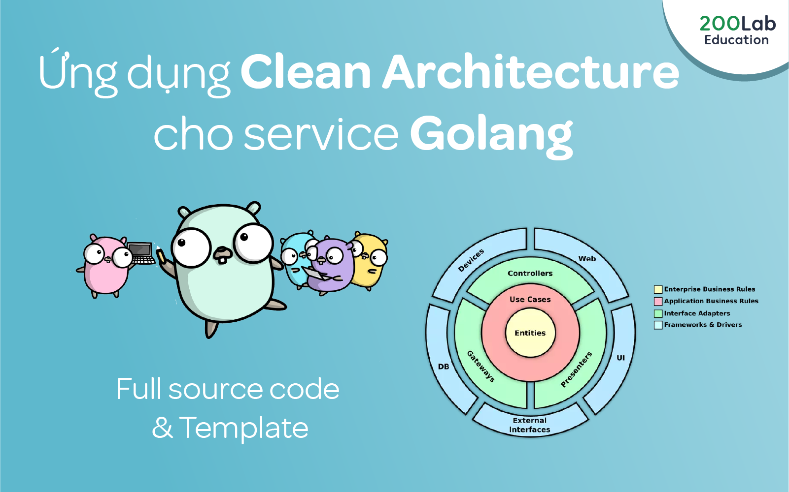

软件行业和建筑行业比较像，如果说我们的产品是一栋高楼大厦，那么程序代码就是建筑高楼的砖坯（我们每天的工作就像是在不停"搬砖"）。


如果说软件架构是高屋建瓴，那么程序代码是软件架构能够准确落地的关键构成。


程序代码如此重要，那么有一个好的代码架构的重要性不言而喻。一个好的软件架构能够让开发人员快速响应业务变化、提高软件的整体开发和维护效率。

一个好的架构，其终极目标应当是，**用最小的人力成本满足构建和维护该系统的需求**。

也就是说，好的架构目标应当是降低人力成本，这里包括的不仅仅是开发成本，还有构建运维成本。而增加软件可变性就是架构达到最终目标的核心途径，即架构主要是通过增加软件的可变性来降低人力成本，毕竟，捏橡皮泥比你在石头上雕刻要轻松得多。

▐  行为和架构哪个重要？

一个软件的行为固然是很重要的，因为**一个不能按预定行为工作的软件是不会产生价值的**，所以很多程序员认为能实现软件行为是最重要的，根本不该关心架构，反正坏的架构也不是实现不了行为，出了 bug 修复即可。我认为，他们忽略的是随着软件行为的改动，坏的架构将导致他们自己的工作越来越难以进行，改动的代码越来越大，bug 越来越多，项目最终可能不可维护。

一个软件的架构虽然不直接表现在行为上，但其最大的特点就是良好的**可变性**，即使目前行为不符合预期，也能通过低成本的改动将行为改变到预期。

可运行不可变的软件，最终会因为无法改变而导致行为无法迭代或者迭代慢而变成没有价值。可变不可运行的软件，可通过迭代，变成可运行可变软件，所以**架构比行为更重要**。

▐  恶魔小时候也可爱


一个不太好的架构，在项目初期有时难以察觉，因为此时项目模块少，功能少，依赖关系显而易见，一切显得毫无恶意，甚至有点简洁美。但是，恶魔小时候往往也很可爱。随着项目的增长，模块增加了，开发人员变多了，恶魔长大了。架构带来的问题逐渐暴露了出来，混乱的层次关系，毫无章法的依赖关系，模块权责不清等问题接踵而至。

对开发人员而言，项目理解成本不断增加，添加小功能都要先理清好几个模块的调用关系，难以测试导致上线后 bug 防不胜防，组件无法复用。项目逐渐长成大家闻风丧胆，避而不及的“大恶魔”。

虽然我们也反对过度设计，但是识别，或者说猜测项目未来符合逻辑的可能变动，将架构设计考虑进项目早期是十分有必要的，架构设计和调整应该贯穿项目的整个成长过程。

▐  识别过度设计

架构设计是为了让未来的修改更加容易，但是未来谁又能完全预测准确呢，架构设计或多或少有一定猜测成分在里面，但是更多的是吸取 IT 行业几十年发展过程中前辈们的经验以及对业务特点的了解所作出的符合一定逻辑的猜测。

那什么算过度设计呢？从架构的目的是降低人力来看，就是该设计目前没有任何强有力的逻辑能推出能在未来降低修改某种行为的人力成本，或者降低某种行为修改成本的同时，大大增加了另外一种行为的修改成本。

▐  架构的理解成本

架构是有一定理解成本的，甚至架构设计之初会增加一定的系统理解成本，但是一个好的架构理解成本一定不会很高，因为架构的理解也是人力成本。在理解架构设计的意图之前，因为其增加系统的理解成本而否定它的必要性是不合逻辑的。

好的架构，其关键意义在于降低项目发展过程中整体理解成本。

也就是说，架构良好的项目随着业务复杂度增加，项目理解成本增长也是缓慢的。架构不合理的项目随着业务复杂度的增加，整体理解成本可能是指数增长的。


### The Clean Architecture

[Robert C. Martin](https://zhuanlan.zhihu.com/p/117365294) 在[简洁架构](https://blog.cleancoder.com/uncle-bob/2012/08/13/the-clean-architecture.html)里面对我们的项目提出了几点要求：

▐  独立于框架

该架构不依赖于某些功能丰富的软件库的存在。这允许你把这些框架作为工具来使用，而不是把你的系统塞进它们有限的约束中。

▐  可测试

业务规则可以在没有UI、数据库、Web服务器或任何其他外部元素的情况下被测试。

▐  独立于用户界面

UI可以很容易地改变，而不用改变系统的其他部分。例如，一个Web UI可以被替换成一个控制台UI，而不改变业务规则。

▐  独立于数据库

你可以把 `Oracle` 或 `MySQL` 换成 `Mongo`、`BigTable`、`CouchDB ` 或其他东西。你的业务规则不受数据库的约束。

▐  独立于任何外部机构

事实上，你的业务规则根本不知道外部世界的任何情况。

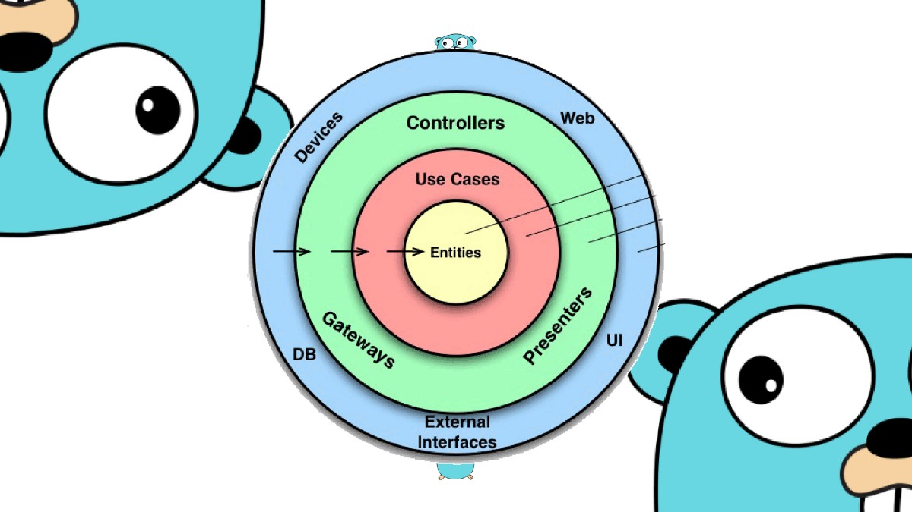

上图中同心圆代表各种不同领域的软件。

一般来说，越深入代表你的软件层次越高。外圆是战术实现机制，内圆的是战略核心策略。

对于我们的项目来说，代码依赖应该由外向内，单向单层依赖，这种依赖包含代码名称，或类的函数，变量或任何其他命名软件实体。

对于简洁架构来说分为了四层：

- **Entities**：实体
- **Usecase**：表达应用业务规则，对应的是应用层，它封装和实现系统的所有用例；
- **Interface Adapters**：这一层的软件基本都是一些适配器，主要用于将用例和实体中的数据转换为外部系统如数据库或Web使用的数据；
- **Framework & Driver**：最外面一圈通常是由一些框架和工具组成，如数据库Database, Web框架等；

### 通用应用目录分层

**目录结构基本上就是一个项目的门面**，很多时候我们从目录结构中就能够看出开发者对这门语言是否有足够的经验，所以在这里首先要介绍的最佳实践就是如何在 Go 语言的项目或者服务中组织代码。

官方并没有给出一个推荐的目录划分方式，很多项目对于目录结构的划分也非常随意，这其实也是没有什么问题的，但是社区中还是有一些比较常见的约定，例如：[golang-standards/project-layout](https://github.com/golang-standards/project-layout) 项目中就定义了一个比较标准的目录结构。

```
------------------------- go目录 ----------------------------
/cmd：项目的可执行文件名称相符，通常有一个简短的main函数。从/internal和/pkg目录导入代码。其他没有了
/internal： 私有应用程序和库代码
/pkg：外部应用可以导入的库代码
/vendor：应用程序依赖项
-----------------服务应用程序目录 ---------------
/api：协议文件
/web:  静态web组件
-----------------通用应用目录 ---------------
/configs：项目的默认配置
/init：system init （systemd，upstart，sysv) 配置
/scripts：执行各种构建、安装、分析等操作的脚本
/build：打包和持续集成
/deployments：部署配置
/test：测试
-----------------其他目录 ---------------
/docs：文档
/tools：项目支持的工具
/examples：应用程序和公共库实例
/third_party：外部工具
/githooks: - 
/assets: 图片和其他存储的文件
/website：-
不应该有的目录
/src：请不要将项目级别的src目录和工作空间的src目录混淆。
```

### Go 目录

**▐  cmd**

当前项目的**可执行文件**。`cmd` 目录下的每一个**子目录名称都应该匹配可执行文件**。比如果我们的项目是一个 `grpc` 服务，在 /cmd/**myapp**/main.go 中就包含了启动服务进程的代码，编译后生成的可执行文件就是 ▐  **myapp**。

不要在 `/cmd` 目录中放置太多的代码，我们应该将**公有代码**放置到 `/pkg` 中，将**私有代码**放置到 `/internal` 中并在 `/cmd` 中引入这些包，**保证 main 函数中的代码尽可能简单和少**。

例子：

- [velero](https://github.com/vmware-tanzu/velero/tree/main/cmd)
- [moby](https://github.com/moby/moby/tree/master/cmd)
- [prometheus](https://github.com/prometheus/prometheus/tree/master/cmd)
- [influxdb](https://github.com/influxdata/influxdb/tree/master/cmd)
- [kubernetes](https://github.com/kubernetes/kubernetes/tree/master/cmd)
- [dapr](https://github.com/dapr/dapr/tree/master/cmd)
- [ethereum](https://github.com/ethereum/go-ethereum/tree/master/cmd)

> 注：`cmd` 目录存在有一个前提，那就是项目有**多个可执行文件**，如果你的项目是**微服务**，那么通常是**只有一个可执行文件**的。这时，建议大家直接将 `main.go` 放在项目根目录下，而取消 `cmd` 目录。

▐  **internal**

**私有的**应用程序代码库。这些是不希望被其他人导入的代码。请注意：这种模式是 Go **编译器强制执行**的。有关更多细节，请参阅 Go 1.4 的 [release notes](https://golang.org/doc/go1.4#internalpackages)。并且，在项目的目录树中的**任意位置都可以有 internal 目录**，而不仅仅是在顶级目录中。

私有代码推荐放到 `/internal` 目录中，真正的项目代码应该写在 `/internal/app` 里，同时这些内部应用依赖的代码库应该在 `/internal/pkg` 子目录和 `/pkg` 中，下图展示了一个使用 `/internal` 目录的项目结构：

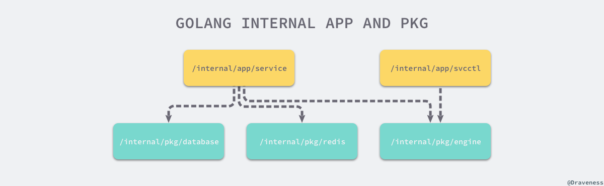

当我们在其他项目引入包含 `internal` 的依赖时，Go 语言会在编译时报错：

```text
An import of a path containing the element “internal” is disallowed
if the importing code is outside the tree rooted at the parent of the 
"internal" directory.
```

这种错误只有在被引入的 `internal` 包不存在于当前项目树中才会发生，如果在同一个项目中引入该项目的 `internal` 包并不会出现这种错误。

▐  **pkg**

**外部应用程**序可以使用的库代码（如，`/pkg/mypubliclib`）。其他项目将会导入这些库来保证项目可以正常运行，所以在将代码放在这里前，一定要三四而行。请注意，`internal` 目录是一个更好的选择来确保项目私有代码不会被其他人导入，因为这是 Go 强制执行的。使用 `/pkg` 目录来明确表示代码可以被其他人安全的导入仍然是一个好方式。Travis Jeffery 撰写的关于 [I’ll take pkg over internal](https://travisjeffery.com/b/2019/11/i-ll-take-pkg-over-internal/) 文章很好地概述了 `pkg` 和 `inernal` 目录以及何时使用它们。

`/pkg` 在许多开源项目中都使用了，但**未被普遍接受，并且 Go 社区中的某些人不推荐这样做**。

如果**项目确实很小**并且嵌套的层次并不会带来多少价值（除非你就是想用它），那么就不要使用它。**但当项目变得很大，并且根目录中包含的内容相当繁杂**（尤其是有很多非 Go 的组件）时，可以考虑使用 `/pkg`。

例子：

- [prometheus](https://github.com/prometheus/prometheus) 上报和存储指标的时序数据库
- [istio](https://github.com/istio/istio) 服务网格 2.0
- [kubernetes](https://github.com/kubernetes/kubernetes) 容器调度管理系统
- [grafana](https://github.com/grafana/grafana) 展示监控和指标的仪表盘

> 注：
>
> - 对于 `pkg` 目录，如果是在**微服务下，更我建议尽量不使用它**。因为微服务，每个服务都会相对简单，也就是**项目都比较小** pkg 不会带来多大价值。
> - 如果有**公用的代码**，这里更建议大家将这类代码做成**私有库（go module）**，供其他项目复用，**做了物理隔离，更有利于代码的抽象**。
> - 但是，有一种情况，可以考虑使用 `pkg`，那就是有一类**公用的代码只在有限几个项目中可公用**。比如：在**权限服务**中需要使用到**用户服务**的 `User` 结构体，那这种公用的代码，可以考虑放在用户服务的 `pkg` 中，供权限服务引用。

> 注：在 Go 语言中组织代码的方式还有一种叫”平铺“的，也就是**在根目录下放项目的代码**。这种方式在很多**框架或者库**中非常常见，如果想要引入一个使用 pkg 目录结构的框架时，我们往往需要使用 `github.com/golang/project/pkg/somepkg`，当代码都平铺在项目的根目录时只需要使用 `github.com/golang/project`，很明显地减少了引用依赖包语句的长度。所以，对于一个 Go 语言的**框架或者库，将代码平铺在根目录下也很正常**，但是在一个 Go 语言的**服务中使用这种代码组织方法可能就没有那么合适了**。

▐  **vendor**

应用程序的依赖关系（通过手动或者使用喜欢的依赖管理工具，如新增的内置 Go Modules 特性）。执行 `go mod vendor` 命令将会在项目中创建 `/vendor` 目录，注意，如果使用的不是 Go 1.14 版本，在执行 `go build` 进行编译时，需要添加 `-mod=vendor` 命令行选项，因为它不是默认选项。

构建库文件时，不要提交应用程序依赖项。

请注意，从 1.13 开始，Go 也启动了模块代理特性（使用 [https://proxy.golang.org](https://proxy.golang.org/) 作为默认的模块代理服务器）。点击[这里](https://blog.golang.org/module-mirror-launch)阅读有关它的更多信息，来了解它是否符合所需要求和约束。如果 Go Module 满足需要，那么就不需要 vendor 目录。

国内模块代理功能默认是被墙的，七牛云有维护专门的的[模块代理](https://github.com/goproxy/goproxy.cn/blob/master/README.zh-CN.md)。

> 注：从我的实践来看，**Go Module 已经满足需要，不需要 vendor 目录**。

### 服务端应用程序目录

▐  **api**

`/api` 目录中存放的就是当前项目对外提供的各种不同类型的 API 接口定义文件了，其中可能包含类似 `/api/protobuf-spec`、`/api/thrift-spec` 或者 `/api/http-spec` 的目录，这些目录中包含了当前项目对外提供的和依赖的所有 API 文件：

```bash
$ tree ./api
api
└── user
└── auth
└── comment
```

二级目录的主要作用就是在一个项目同时提供了多种不同的访问方式时，用这种办法避免可能存在的潜在冲突问题，也可以让项目结构的组织更加清晰。

### Web 应用程序目录

▐  **web**

Web 应用程序特定的组件：静态 Web 资源，服务器端模板和单页应用（Single-Page App，SPA）

> 注：如果项目是个**前后端**的，并且是**一个团队开发**的，那么可以将前端项目放在 `web` 目录下，方便**项目管理**、**构建**、**部署**等，如：[gin-vue-admin](https://github.com/flipped-aurora/gin-vue-admin/tree/main/web)

### 通用应用程序目录

▐  **build**

**打包和持续集成**所需的文件。

- build/ci：存放持续集成的配置和脚本，如果持续集成平台(例如 Travis CI)对配置文件有路径要求，则可将其 link 到指定位置。
- build/package：存放 AMI、Docker、系统包（deb、rpm、pkg）的配置和脚本等。

例子：

- [cockroach](https://github.com/cockroachdb/cockroach/tree/master/build)

> 注：笔者觉得将对配置文件有路径要求的 link 到指定位置，太过**为了什么而做什么了**，有点**本末倒置**，这样不但没有太大的价值，而且会**给熟悉配置文件的人感觉疑惑，得不偿失**。

▐  **configs**

**配置文件**模板或**默认配置**。

▐  **deployments / deploy**

IaaS，PaaS，系统和容器编排部署配置和模板（docker-compose，kubernetes/helm，mesos，terraform，bosh）。请注意，在某些存储库中（尤其是使用 kubernetes 部署的应用程序），该目录的名字是 **/deploy**。

> 注：如果是用 kubernetes 部署，建议改成 `deploy`，因为在 kubernetes 领域内更让人熟悉。

▐  **init**

系统初始化（`systemd`、`upstart`、`sysv`）和进程管理（`runit`、`supervisord`）配置。

▐  **scripts**

用于执行各种**构建，安装，分析**等操作的脚本。

这些脚本**使根级别的 Makefile 变得更小更简单**。

例子：

- [helm](https://github.com/kubernetes/helm/tree/master/scripts)
- [cockroach](https://github.com/cockroachdb/cockroach/tree/master/scripts)
- [terraform](https://github.com/hashicorp/terraform/tree/main/scripts)

▐  **test**

**外部测试应用程序和测试数据**。随时根据需要构建 `/test` 目录。对于较大的项目，有一个数据子目录更好一些。例如，如果需要 Go 忽略目录中的内容，则可以使用 `/test/data` 或 `/test/testdata` 这样的目录名字。请注意，Go 还将忽略以“.”或“_”开头的目录或文件，因此可以更具灵活性的来命名测试数据目录。

例子：

- [origin](https://github.com/openshift/origin/tree/master/test) (测试数据在 `/testdata` 子目录)

### 其他目录

▐  **assets**

项目中使用的其他资源（图像、logo 等）。

▐  **docs**

**设计和用户文档**（除了 godoc 生成的文档）。

例子：

- [hugo](https://github.com/gohugoio/hugo/tree/master/docs)
- [gin-vue-admin](https://github.com/flipped-aurora/gin-vue-admin/tree/main/docs)
- [origin](https://github.com/openshift/origin/tree/master/docs)
- [dapr](https://github.com/dapr/dapr/tree/master/docs)

▐  **examples**

应用程序或公共库的示例程序。

例子：

- [nats.go](https://github.com/nats-io/nats.go/tree/master/examples)
- [docker-slim](https://github.com/docker-slim/docker-slim/tree/master/examples)
- [hugo](https://github.com/gohugoio/hugo/tree/master/examples)
- [packer](https://github.com/hashicorp/packer/tree/master/examples)

▐  **githooks**

Git 钩子。

▐  **third_party**

外部辅助工具，**fork 的代码**和其他第三方工具（例如：Swagger UI）。

▐  **tools / utils**

此项目的支持工具。请注意，这些工具可以从 `/pkg` 和 `/internal` 目录导入代码。

例子：

- [istio](https://github.com/istio/istio/tree/master/tools)
- [origin](https://github.com/openshift/origin/tree/master/tools)
- [dapr](https://github.com/dapr/dapr/tree/master/tools)

▐  **website**

如果不使用 Github pages，则在这里放置项目的网站数据。

例子：

- [vault](https://github.com/hashicorp/vault/tree/master/website)
- [perkeep](https://github.com/perkeep/perkeep/tree/master/website)

### 不应该出现的目录

▐  **src**

有一些 Go 项目确实包含 `src` 文件夹，但通常只有在开发者是从 Java（这是 Java 中一个通用的模式）转过来的情况下才会有。如果可以的话请不要使用这种 Java 模式。你肯定不希望你的 Go 代码和项目看起来向 Java。

不要将项目级别的 `/src` 目录与 Go 用于其工作空间的 `/src` 目录混淆，就像 [How to Write Go Code](https://golang.org/doc/code.html)中描述的那样。`$GOPATH`环境变量指向当前的工作空间（默认情况下指向非 Windows 系统中的$HOME/go）。此工作空间包括顶级 `/pkg`，`/bin` 和 `/src` 目录。实际的项目最终变成 `/src` 下的子目录，因此，如果项目中有 `/src` 目录，则项目路径将会变成：`/some/path/to/workspace/src/your_project/src/your_code.go`。请注意，使用 Go 1.11，可以将项目放在 `GOPATH` 之外，但这并不意味着使用此布局模式是个好主意。

### 其他文件

▐  **Makefile**

在任何一个项目中都会存在一些需要运行的脚本，

这些脚本文件应该被放到 `/scripts` 目录中并**由 Makefile 触发**。

### Web应用目录

常见的业务项目基本目录结构如下：

<details>
<summary>展开查看</summary>
<pre>
<code>
    ├── app ----------------------------- (项目文件)
        ├── api ------------------------- (对外接口)
		├── global ---------------------- (全局组件对象)
		├── internal -------------------- (内部逻辑)
			├── middleware -------------- (中间件)
			├── model ------------------- (模型层)
			├── service ----------------- (服务层)
		├── router ---------------------- (路由层)
    ├── manifest ------------------------ (交付清单)
       ├── deploy ----------------------- (部署配置文件)
          ├── docker -------------------- (docker配置文件)
          ├── kustomize ----------------- (k8s配置文件)
       ├── sql -------------------------- (mysql初始化配置文件)
    ├── utils --------------------------- (工具包) 
    ├── build.sh ------------------------ (应用运行脚本)
    ├── docker-compolse.yml ------------- (容器构建配置)
    ├── go.mod -------------------------- (go依赖)
    ├── main.go ------------------------- (项目运行入口)
    ├── README.md ----------------------- (项目说明文档)
</code>
</pre>
</details>

#### 对外接口 (api)

服务接口的职责类似于三层架构设计中的`UI`表示层，负责接收并响应客户端的输入与输出，包括对输入参数的过滤、转换、校验，对输出数据结构的维护，并调用 `service` 实现业务逻辑处理。

#### 业务实现 (service)

业务实现的职责类似于三层架构设计中的`BLL`业务逻辑层，负责具体业务逻辑的实现以及封装。

一是用于解耦业务模块之间的调用。

二是负责具体业务逻辑的实现以及封装。

#### 结构模型 (model)

`model`包的职责类似于三层架构中的`Model`模型定义层。模型定义代码层中仅包含全局公开的数据结构定义，往往不包含方法定义。

这里需要注意的是，这里的`model`不仅负责维护数据实体对象（`entity`）结构定义，也包括所有的输入/输出数据结构定义，被`service`共同引用。这样做的好处除了可以统一管理公开的数据结构定义，也可以充分对同一业务领域的数据结构进行复用，减少代码冗余。

▐  数据模型 - `entity`

与数据集合绑定的程序数据结构定义，通常和数据表一一对应。

▐  业务模型 - `model`

与业务相关的通用数据结构定义，其中包含大部分的方法输入输出定义。

▐  数据访问 - `dao`

`dao`的职责类似于三层架构中的`DAL`数据访问层，数据访问层负责所有的数据访问收口。

#### 请求分层流转


▐  **cmd**

`cmd`层负责引导程序启动，显著的工作是初始化逻辑、注册路由对象、启动`server`监听、阻塞运行程序直至`server`退出。

▐  **api**

上层`server`服务接收客户端请求，转换为`api`中定义的`Req`接收对象、执行请求参数到`Req`对象属性的类型转换、执行`Req`对象中绑定的基础校验并转交`Req`请求对象给`controller`层。

▐  **controller**

`controller`层负责接收`Req`请求对象后做一些业务逻辑校验，随后调用一个或多个`service`实现业务逻辑，将执行结构封装为约定的`Res`数据结构对象返回。

▐  **model**

`model`层中管理了所有的业务模型，`service`资源的`Input/Output`输入输出数据结构都由`model`层来维护。

▐  **service**

`service`是接口层，用于解耦业务模块，`service`没有具体的业务逻辑实现，具体的业务实现是依靠`logic`层注入的。

▐  **logic**

`logic`层的业务逻辑需要通过调用`dao`来实现数据的操作，调用`dao`时需要传递`do`数据结构对象，用于传递查询条件、输入数据。`dao`执行完毕后通过`Entity`数据模型将数据结果返回给`service`层。

▐  **dao**

`dao`层通过框架的`ORM`抽象层组件与底层真实的数据库交互

**如何清晰界定和管理`service`和`controller`的分层职责**

`controller`层处理`Req/Res`外部接口请求。负责接收、校验请求参数，并调用**一个或多个** `service`来实现业务逻辑处理，根据返回数据结构组装数据再返回。`service`层处理`Input/Output`内部方法调用。负责内部**可复用**的业务逻辑封装，封装的方法粒度往往比较细。

在真实项目实践中，存在从`controller`层直接透传`Req`对象给`service`，同时`service`直接返回`Res`数据结构对象的情况。但当使用`service`方法处理特定的`Req`对象时，该方法也就与对于的外部接口耦合，仅为外部接口服务，难以复用。这样做会有一定的技术债务成本，具体成本需要自行具体衡量把握尺度。

**如何清晰界定和管理`service`和`dao`的分层职责**

这是一个很经典的问题。

**痛点：**

常见的，开发者把数据相关的业务逻辑实现封装到了`dao`代码层中，而`service`代码层只是简单的`dao`调用，这么做的话会使得原本负责维护数据的`dao`层代码越来越繁重，反而业务逻辑`service`层代码显得比较轻。开发者存在困惑，我写的业务逻辑代码到底应该放到`dao`还是`service`中？

业务逻辑其实绝大部分时候都是对数据的`CURD`处理，这样做会使得几乎所有的业务逻辑会逐步沉淀在`dao`层中，业务逻辑的改变其实会频繁对`dao`层的代码产生修改。例如：数据查询在初期的时候可能只是简单的逻辑，目前代码放到`dao`好像也没问题，但是查询需求增加或变化变得复杂之后，那么必定会继续维护修改原有的`dao`代码，同时`service`代码也可能同时做更新。原本仅限于`service`层的业务逻辑代码职责与`dao`层代码职责模糊不清、耦合较重，原本只需要修改`service`代码的需求变成了同时修改`service`+`dao`，使得项目中后期的开发维护成本大大增加。

**建议：**

我们的建议。`dao`层的代码应该尽量保证通用性，并且大部分场景下不需要增加额外方法，只需要使用一些通用的链式操作方法拼凑即可满足。业务逻辑、包括看似只是简单的数据操作的逻辑都应当封装到`service`中，`service`中包含多个业务模块，每个模块独自管理自己的`dao`对象，`service`与`service`之间通过相互调用方法来实现数据通信而不是随意去调用其他`service`模块的`dao`对象。

**为什么要使用`internal`目录包含业务代码**

`internal`目录是`Golang`语言专有的特性，防止同级目录外的其他目录引用其下面的内容。业务项目中存在该目录的目的，是避免若项目中存在多个子项目（特别是大仓管理模式时），多个项目之间无限制随意访问，造成难以避免的多项目不同包之间耦合。

### 小结

每个公司、组织内部都有自己的组织方式，但每个项目都应该有一定的规范。虽然这种规范的约定没有那么强制，但是只要达成了一致之后，对于团队中组员快速理解和入门项目都是很有帮助的。有时候**一些规范，就是团队的共同语言，定好了规范，减少了不必要的重复沟通，有利于提高整体的效率**。

项目目录也一样，本篇文章讲的是参考 [golang-standards](https://github.com/golang-standards/project-layout) 提供的规范。但是，**最重要的还是要与自己的团队商量，讨论并整理出适合自己的一套项目目录规范**。

**一致的项目目录规范，有助于组员快速理解其他人的代码，不容易造成团队的”单点故障“；团队团结一致，共同维护和升级项目目录结构，可不断沉淀，不断提高效率，减少犯错**。

## 🔌 API设计

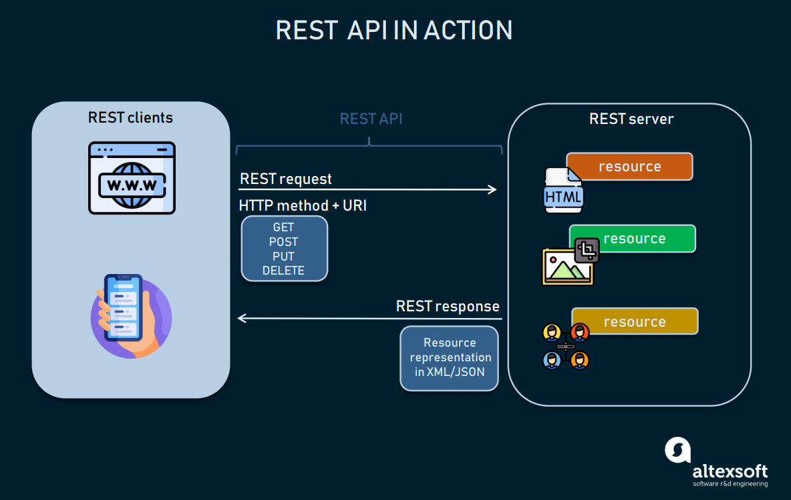

> 本规范在 API 设计上遵循 REST 架构风格，本部分会针对如何实现 RESTful API，作出说明

### REST 介绍

REST涉及一些概念性的东西可能比较多，在实战 **RESTful API** 之前，要对REST相关的知识有个系统的认知。

#### 诞生

REST（英文：Representational State Transfer，简称REST，直译过来表现层状态转换）是一种软件架构风格、设计风格，而不是标准，只是提供了一组设计原则和约束条件。它主要用于客户端和服务器交互类的软件。基于这个风格设计的软件可以更简洁，更有层次，更易于实现缓存等机制。


它首次出现在 2000 年 Roy Thomas Fielding 的博士论文中，这篇论文定义并详细介绍了表述性状态转移（Representational State Transfer，REST）的架构风格，并且描述了 如何使用 REST 来指导现代 Web 架构的设计和开发。用他自己的原话说：

> 我写这篇文章的目的是：在符合架构原理前提下，理解和评估基于网络的应用软件的架构设计，得到一个功能强、性能好、适宜通信的架构。

需要注意的是**REST并没有一个明确的标准，而更像是一种设计的风格**，满足这种设计风格的程序或接口我们称之为RESTful(从单词字面来看就是一个形容词)。所以RESTful API 就是满足REST架构风格的接口。

#### 意义

既然知道REST和RESTful的联系和区别，现在就要开始好好了解RESTful的一些约束条件和规则，RESTful是一种风格而不是标准。

要理解 RESTful 架构，最好的方法就是去理解 Representational State Transfer 这个词组到底是什么意思，它的每一个词代表了什么涵义。如果把这个名称搞懂了，也就不难体会 REST 是一种什么样的设计。

▐  **资源 （Resources）**
REST 的名称 "表现层状态转化" 中，省略了主语。"表现层" 其实指的是 "资源"（Resources）的 "表现层"。

所谓 "资源"，就是网络上的一个实体，或者说是网络上的一个具体信息。它可以是一段文本、一张图片、一首歌曲、一种服务，总之就是一个具体的实在。你可以用一个 URI（统一资源定位符）指向它，每种资源对应一个特定的 URI 。要获取这个资源，访问它的 URI 就可以，因此 URI 就成了每一个资源的地址或独一无二的识别符。所谓 "上网"，就是与互联网上一系列的 "资源" 互动，调用它的 URI 。

▐  **表现层（Representation）**
"资源" 是一种信息实体，它可以有多种外在表现形式。我们把 "资源" 具体呈现出来的形式，叫做它的 "表现层"（Representation）。
比如，文本可以用 txt 格式表现，也可以用 HTML 格式、 XML 格式、JSON 格式表现，甚至可以采用二进制格式；图片可以用 JPG 格式表现，也可以用 PNG 格式表现。
URI 只代表资源的实体，不代表它的形式。严格地说，有些网址最后的 ".html" 后缀名是不必要的，因为这个后缀名表示格式，属于 "表现层" 范畴，而 URI 应该只代表 "资源" 的位置。它的具体表现形式，应该在 HTTP 请求的头信息中用 Accept 和 Content-Type 字段指定，这两个字段才是对 "表现层" 的描述。

▐  **状态转化（State Transfer）**
访问一个网站，就代表了客户端和服务器的一个互动过程。在这个过程中，势必涉及到数据和状态的变化。
互联网通信协议 HTTP 协议，是一个无状态协议。这意味着，所有的状态都保存在服务器端。因此，如果客户端想要操作服务器，必须通过某种手段，让服务器端发生 "状态转化"（State Transfer）。而这种转化是建立在表现层之上的，所以就是 "表现层状态转化"。
客户端用到的手段，只能是 HTTP 协议。具体来说，就是 HTTP 协议里面，四个表示操作方式的动词：GET 、 POST 、 PUT 、 DELETE 。 它们分别对应四种基本操作： GET 用来获取资源， POST 用来新建资源，PUT 用来更新资源，DELETE 用来删除资源。

##### 综述

总结一下什么是 RESTful 架构：

- 每一个 URI 代表一种资源；
- 客户端和服务器之间，传递这种资源的某种表现层；
- 客户端通过四个 HTTP 动词，对服务器端资源进行操作，实现 "表现层状态转化"。

#### 架构特征

从请求的流程来看，RESTful API和传统API大致架构如下：

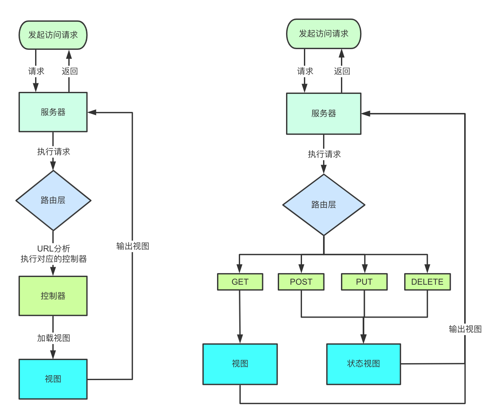

▐  **URI指向资源**

URI = Universal Resource Identifier 统一资源标志符，用来标识抽象或物理资源的一个紧凑字符串。URI包括URL和URN，在这里更多时候可能代指URL(统一资源定位符)。RESTful是面向资源的，每种资源可能由一个或多个URI对应，但一个URI只指向一种资源。

▐  **无状态**

服务器不能保存客户端的信息， 每一次从客户端发送的请求中，要包含所有必须的状态信息，会话信息由客户端保存， 服务器端根据这些状态信息来处理请求。 当客户端可以切换到一个新状态的时候发送请求信息， 当一个或者多个请求被发送之后, 客户端就处于一个状态变迁过程中。 每一个应用的状态描述可以被客户端用来初始化下一次的状态变迁。

#### REST架构限制条件

Fielding在论文中提出REST架构的6个**限制条件**，也可称为RESTful 6大原则， 标准的REST约束应满足以下6个原则：

**▐  客户端-服务端（Client-Server）**:

这个更专注客户端和服务端的分离，服务端独立可更好服务于前端、安卓、IOS等客户端设备。

▐  **无状态（Stateless）**

服务端不保存客户端状态，客户端保存状态信息每次请求携带状态信息。

**▐  可缓存性（Cacheability）** 

服务端需回复是否可以缓存以让客户端甄别是否缓存提高效率。

▐  **统一接口（Uniform Interface）**

通过一定原则设计接口降低耦合，简化系统架构，这是RESTful设计的基本出发点。当然这个内容除了上述特点提到部分具体内容比较多详细了解可以参考这篇 [REST论文内容](https://www.ics.uci.edu/~fielding/pubs/dissertation/rest_arch_style.htm)。

▐  **分层系统（Layered System）**

客户端无法直接知道连接的到终端还是中间设备，分层允许你灵活的部署服务端项目。

▐  **按需代码（Code-On-Demand，可选）**

按需代码允许我们灵活的发送一些看似特殊的代码给客户端例如JavaScript代码。

REST架构的一些风格和限制条件就先介绍到这里，后面就对RESTful风格API具体介绍。

### 设计规范

整个RESTful API设计主要分为两个大的部分：

**描述资源（resource）的URI **和 对**资源进行行操作的方法（method）**。

在这里，分为三个主要部分来讲：

- 对于资源的URI（Uniform Resource Identifier）设计实践
- 对于方法的设计实践，这里，我把最常用的方法（GET、POST、PUT、和DELETE）讲一下
- 对于一些比较特殊的场景，比如，设计支持复杂query/search能力的RESTful API，支持异步处理的RESTful API等，进行一个case by case的说明。

#### URI设计

在RESTful API设计中，最主要的目的其实是**让整个接口更具有自描述性**，这样在接口的易用性上和可维护性上才能有更好的表现。

关于资源的URI，简单来讲就是用来在web环境下**如何定位一个资源的描述标准**。

URL为统一资源定位器 ,接口属于服务端资源，首先要通过URL这个定位到资源才能去访问，而通常一个完整的URL组成由以下几个部分构成：

```ini
URI = scheme "://" host  ":"  port "/" path [ "?" query ][ "#" fragment ]
```

- **scheme**： 指底层用的协议，如http、https、ftp

    如果能全站 HTTPS 当然是最好的，不能的话也请尽量将登录、注册等涉及密码的接口使用 HTTPS。

- **host**：服务器的IP地址或者域名

- **port**： 端口，http默认为80端口

- **domain**：域名，等同于 host + port

    应该尽量将API部署在专用域名之下。

    > ```javascript
    > https://api.example.com
    > ```

    如果确定API很简单，不会有进一步扩展，可以考虑放在主域名下。

    > ```javascript
    > https://example.org/api/
    > ```

- **path**：访问资源的路径，就是各种web 框架中定义的route路由

- **query**: 查询字符串，为发送给服务器的参数，在这里更多发送数据分页、排序等参数。

- **fragment**：锚点，定位到页面的资源

我们在设计API时URL的path是需要认真考虑的，而RESTful对path的设计做了一些规范，通常一个RESTful API的path组成如下：

```undefined
/{version}/{resources}/{resource_id}
```

- **version**：API版本号，有些版本号放置在头信息中也可以，通过控制版本号有利于应用迭代。

    应该将API的版本号放入URL。

    > ```javascript
    > https://api.example.com/v1/
    > ```

    另一种做法是，将版本号放在HTTP头信息中，但不如放入URL方便和直观。[Github](https://developer.github.com/v3/media/#request-specific-version)采用这种做法。

- **resources**：资源，RESTful API推荐用小写英文单词的复数形式。

- **resource_id**：资源的id，访问或操作该资源。

当然，有时候可能资源级别较大，其下还可细分很多子资源也可以灵活设计URL的path，例如：

```undefined
/{version}/{resources}/{resource_id}/{subresources}/{subresource_id}
```

从大体样式了解URL路径组成之后，对于RESTful API的URL具体设计的规范如下：

1. 不用大写字母，所有单词使用英文且小写。
2. 正确使用 `"/"`表示层级关系,URL的层级不要过深，并且越靠前的层级应该相对越稳定
3. 结尾不要包含正斜杠分隔符`"/"`
4. URL中不出现动词，用请求方式表示动作
5. 资源表示用复数不要用单数
6. 不要使用文件扩展名

RESTful API的资源URI一般由两个部分组成的：Path和Query Parameters，下面我来分别介绍和说明一下。

##### Path

主要是**描述一个资源的访问路径的**，而Path的一般要用名词来组成。

在RESTful API设计中Path内容还包含有Path Parameter，也就是动态的参数部分，比如，我们如果有一个Path来指向一个具体的公司资源对象，我们会有如下的Path设计

```
http://www.goodhr.com/api/v1/companies/{公司id}
```

这里{公司id}就是Path parameter，他可以被替换为具体的id值用来表明，那个一个公司资源对象。Path Parameter在整个RESTful API的URI设计理念里面是代表的**必选参数**，也就是说，Path Parameter的值一定要给的，否则这个RESTful API将无法使用，或者会访问到另外一个API的情况。

其实，在面对不同的场景下，Path的设计上是有不同的实践方式的，下面我把常用的列举出来：

- **资源对象集**

如果用来描述一种资源（一个资源的聚合），那么需要用复数形式表示，比如下面的例子：

```
http://www.goodhr.com/api/v1/companies/66/employees
```

- **单独资源对象**

如果用来描述一个资源，那么，这个资源肯定是可以有一个唯一标示的来确定这个资源，比如下面的例子：

```
http://www.goodhr.com/api/v1/companies/66/employees/{员工id}
```

- **资源从属关系**

从属资源关系，比如，员工会从属于一个公司，那么这种uri的设计就应该用下面的方式表达：

```
http://www.goodhr.com/api/v1/companies/66/employees/1001
```

这种方式的表达另外一个作用就是代表了其资源的生命周期的强依赖，简单来讲如果一个公司被删除了，那么其下面的员工也应该不能再被访问或者修改。

- **资源索引关系**

可索引关系的资源，比如，一个员工可以在一个公司里面加入多个部门，那么，部门和员工的关系并不是一个强从属关系，只是说，通过一个部门可以反查出这个部门里面有哪些员工。

```
http://www.goodhr.com/api/v1/companies/66/departments/{部门id}/employees
```

上面这种表达方式，其实和从属关系的资源uri没有太大的不同，只是通过增加了departments一级的路径来描述是某一个部门里面的一群员工。

##### Query Parameters

Query parameter是说在URI中问号（？）之后出现的key-value的参数，

在 `RSETful API` 的设计中其实提供的是一个**可选参数**的作用 — — 不会出现无访问其他资源的情况，并且，也不会造成这个API不能被执行。

在 `RESTful` 的标准中，PUT 和 PATCH 都可以用于修改操作，它们的区别是 PUT 需要提交整个对象，而 PATCH 只需要提交修改的信息。

另一个问题是在 POST 创建对象时，究竟该用表单提交更好些还是用 JSON 提交更好些。其实两者都可以，在我看来它们唯一的区别是 JSON 可以比较方便的表示更为复杂的结构（有嵌套对象）。另外无论使用哪种，请保持统一，不要两者混用。

还有一个建议是最好将过滤、分页和排序的相关信息全权交给客户端，包括过滤条件、页数或是游标、每页的数量、排序方式、升降序等，这样可以使 API 更加灵活。但是对于过滤条件、排序方式等，不需要支持所有方式，只需要支持目前用得上的和以后可能会用上的方式即可，并通过字符串枚举解析，这样可见性要更好些。例如：

搜索，客户端只提供关键词，具体搜索的字段，和搜索方式（前缀、全文、精确）由服务端决定：

```
/users/?query=ScienJus
```

过滤，只需要对已有的情况进行支持：

```
/users/?gender=1
```

分页：

```
/users/?page=2&per_page=20
```

比如，我们需要获取一个公司下的所有员工资源对象，那么，我们的API可以设计如下：

```
http://www.goodhr.com/api/v1/companies/66/employees?page=1&size=100
```

那么上面出现的 `page` 和 `size` 其实就是 **query parameter**，用来作为翻页的参数，

如果，在实现这个 `RESTful API` 的时候，一定要对于当缺少 `page` 或 `size` 的时候，也会有一个缺省的逻辑实现，在这里，我们一般会说在 `page `不给的时候，我们默认是从1开始，如果 `size` 不给与的时候，我们用缺省的页面大小，如：20来代替。


如果记录数量很多，服务器不可能都将它们返回给用户。API应该提供参数，过滤返回结果。

下面是一些常见的参数。

> - ?limit=10：指定返回记录的数量
> - ?offset=10：指定返回记录的开始位置。
> - ?page=2&per_page=100：指定第几页，以及每页的记录数。
> - ?sortby=name&order=asc：指定返回结果按照哪个属性排序，以及排序顺序。
> - ?animal_type_id=1：指定筛选条件

参数的设计允许存在冗余，即允许API路径和URL参数偶尔有重复。

比如，GET /zoo/ID/animals 与 GET /animals?zoo_id=ID 的含义是相同的。

##### 规范

**面向使用者建模**

资源不是数据模型， 也不是领域模型，它的语义应该面向使用者。

**反例：**

```bash
# 面向数据模型设计资源，需要多次请求
/customers/123
/customers/123/baseinfo
/customers/123/tags
复制代码
```

**正例：**

```bash
# 面向使用者设计，可以把资源定义为：顾客档案
/customers_archives/123
复制代码
```

**资源与角色相关**

不同角色的资源可以不同，不同角色使用的资源可以是不一样的，比如：

管理员访问某个顾客的订单：

```bash
GET /customers/123/podcasts
复制代码
```

顾客访问自己的订单：

```bash
GET /my_podcasts
复制代码
```

**一类资源两个 URL**

每个资源都应该只有两个基础 URL（Endpoint），一个 URL 用于集合，另一个用于集合中的某个特定元素。

```bash
/customers      # customer 集合
/customers/1    # customer 集合中的特定元素
复制代码
```

**使用一致的复数名词**

避免混用复数和单数形式，只应该使用统一的复数名词来表达资源。

**反例：**

```bash
GET /story
GET /story/1
复制代码
```

**正例：**

```bash
GET /stories
GET /stories/1 
复制代码
```

**复杂的查询逻辑使用查询字符串**

保持URL简单短小，将复杂或可选参数移动到查询字符串。

```ini
GET /customers?country=usa&state=ca&city=sfo
复制代码
```

**表达资源之间的关联**

当需要对关联在资源1下的资源2进行操作时，使用该形式构造URL：

resources/:resource_id/sub_resources/:sub_resource_id

**反例：**

```bash
GET /cusomters/podcasts/123
GET /getCustomerPodcasts?customer_id=123
复制代码
```

**正例：**

```bash
GET /cusomters/5678/podcasts        # 获取某个客户的所有播客
GET /cusomters/5678/podcasts/123    # 获取某个客户的某个播客
POST /cusomters/5678/podcasts       # 为某个客户创建一个新播客
```

#### 方法设计

在RESTful API中，不同的HTTP请求方法有各自的含义，

这里就展示GET,POST,PUT,DELETE几种请求API的设计与含义分析。针对不同操作，具体的含义如下：

```bash
GET /collection：从服务器查询资源的列表（数组）
GET /collection/resource：从服务器查询单个资源
POST /collection：在服务器创建新的资源
PUT /collection/resource：更新服务器资源
DELETE /collection/resource：从服务器删除资源
```

在非RESTful风格的API中，我们通常使用GET请求和POST请求完成增删改查以及其他操作，查询和删除一般使用GET方式请求，更新和插入一般使用POST请求。从请求方式上无法知道API具体是干嘛的，所有在URL上都会有操作的动词来表示API进行的动作，例如：query，add，update，delete等等。

而RESTful风格的API则要求在URL上都以名词的方式出现，从几种请求方式上就可以看出想要进行的操作，这点与非RESTful风格的API形成鲜明对比。

常用的HTTP动词有下面五个（括号里是对应的SQL命令）。

> - GET（SELECT）：从服务器取出资源（一项或多项）。
> - POST（CREATE）：在服务器新建一个资源。
> - PUT（UPDATE）：在服务器更新资源（客户端提供改变后的完整资源）。
> - PATCH（UPDATE）：在服务器更新资源（客户端提供改变的属性）。
> - DELETE（DELETE）：从服务器删除资源。

还有两个不常用的HTTP动词。

> - HEAD：获取资源的元数据。
> - OPTIONS：获取信息，关于资源的哪些属性是客户端可以改变的。

下面是一些例子。

> - GET /zoos：列出所有动物园
> - POST /zoos：新建一个动物园
> - GET /zoos/ID：获取某个指定动物园的信息
> - PUT /zoos/ID：更新某个指定动物园的信息（提供该动物园的全部信息）
> - PATCH /zoos/ID：更新某个指定动物园的信息（提供该动物园的部分信息）
> - DELETE /zoos/ID：删除某个动物园
> - GET /zoos/ID/animals：列出某个指定动物园的所有动物
> - DELETE /zoos/ID/animals/ID：删除某个指定动物园的指定动物

在谈及GET,POST,PUT,DELETE的时候，就必须提一下接口的**安全性和幂等性**，其中安全性是指方法不会修改资源状态，即读的为安全的，写的操作为非安全的。而幂等性的意思是操作一次和操作多次的最终效果相同，客户端重复调用也只返回同一个结果。

上述四个HTTP请求方法的安全性和幂等性如下：

| HTTP Method | 安全性 | 幂等性 | 解释                                     |
| ----------- | :----- | :----- | ---------------------------------------- |
| GET         | 安全   | 幂等   | 读操作安全，查询一次多次结果一致         |
| POST        | 非安全 | 非幂等 | 写操作非安全，每多插入一次都会出现新结果 |
| PUT         | 非安全 | 幂等   | 写操作非安全，一次和多次更新结果一致     |
| DELETE      | 非安全 | 幂等   | 写操作非安全，一次和多次删除结果一致     |

▐  **GET 方法**

这个方法的使用场景很容易理解，就是获取资源，但是，在实际的实践过程中我发现，GET方法所面对的场景反而是最复杂的。比如，复杂的多条件搜索。

- 获取单独资源对象

获取一个指定的资源对象，比如，通过给定员工id获取一个员工

```
http://www.goodhr.com/api/v1/companies/66/employees/1001
```

返回值

```
{
    "companyId": 66,
    "id": 1001,
    "firstname": "Steve",
    "lastname": "Bill",
    "birthDate": "1982-01-01",
    "gender": "male",    
    "hiredDate": "2019-01-01",
    "socialSecurityNumberMask": "123************789",
    "creationTime": "2019-01-01 09:00:01",
    "updatedTime": "2019-01-01 09:00:01"
}
```

- 获取资源对象集

比如，获取一个公司下的所有员工

```
http://www.goodhr.com/api/v1/companies/66/employees?pageStart=1&pageSize=100&orderBy=creationTime&order=DESC
```

对于一个资源集的返回数据设计上，要尽量用加一层字段来进行更好地表现一组数据以及展示是通过什么条件获得的这组数据，设计可以考虑如下方式：

```
{    
    "queryConditions": {},
    "pagination": {
        "pageStart": 1,
        "pageSize": 100,
        "sorting": {
            "orderBy": "creationTime",
            "order": "DESC"
        }
    },
    "data": {
        "size": 100,
        "records": [
            {
                "companyId": 66,
                "id": 1001,
                "firstname": "Steve",
                "lastname": "Bill",
                "birthDate": "1982-01-01",
                "gender": "male",                
                "hiredDate": "2019-01-01",
                "socialSecurityNumberMask": "123************789",
                "creationTime": "2019-01-01 09:00:01",
                "updatedTime": "2019-01-01 09:00:01"
            }
            ...
        ] 
    }   
}
```

在对于一组资源对象进行获取操作的时候，尽量在返回对象中包含获取时候所使用的参数信息，比如，上面，包含了queryConditions用来表示资源获取的时候搜索条件，这里没有，所以是空，pagination用来说明data里面的资源的分页信息，而data字段中不只是包含了返回的资源集合records还包含了，其实际records的大小，以增加这个接口的易用性。

- 通过搜索获取资源集对象

提供对资源的搜索能力其实在很多系统中都是常见的能力，比如，通过搜索名称获得员工名称，或者是多种条件的组合搜索，比如，姓名加年龄等等。这种RESTful API在设计上，如果用GET方法的话，最大的问题在于GET本身不可以提供request body，所以，一般都会以Query Parameter的方式进行支持。

比如，我们要搜索firstname是steve的，年龄小于60岁的员工，并且，以入职时间倒序来进行返回：

```
http://www.goodhr.com/api/v1/companies/66/employees?firstname=Steve&age=%3C60
pageStart=1&pageSize=100&orderBy=hiredDate&order=DESC{    
    "queryConditions": {
        "firstname":"steve",
        "age": "<60"
    },
    "pagination": {
        "pageStart": 1,
        "pageSize": 100,
        "sorting": {
            "orderBy": "creationTime",
            "order": "DESC"
        }
    },
    "data": {
        "size": 13,
        "records": [
            {
                "companyId": 66,
                "id": 1001,
                "firstname": "Steve",
                "lastname": "Bill",
                "birthDate": "1982-01-01",
                "gender": "male",                
                "hiredDate": "2019-01-01",
                "socialSecurityNumberMask": "123************789",
                "creationTime": "2019-01-01 09:00:01",
                "updatedTime": "2019-01-01 09:00:01"
            }
            ...
        ] 
    }   
}
```

很多人其实很害怕使用GET来做复杂搜索的话，因为URL的长度限制会有问题，不过，根据http的标准规定2048个字符以内都是没有问题的，所以，一般系统提供的对于资源的搜索能力应该是足够满足了。当然，我们不可否认其实，还是有一些复杂的搜索场景出现的，如果，是这样，可以看后面的三部分的关于特殊场景的一些设计实践介绍。

▐  **POST 方法**

POST方法代表对uri所描述的资源进行创建一个新的资源。POST方法是可以携带请求体的（request body），RESTful API的body一般使用的是JSON类型。而POST方法的返回类型一般也是JSON格式，并且，HTTP的status code应该是201（Created）

定义一个POST RESTful API一般有两种场景：

- 资源Id不确定

如果，你要创建的资源的Id是由Server来分发的，那么一般，URI应该是按照**资源集**的设计风格。比如，创建一个新的职员，其URI如下

```
http://www.goodhr.com/api/v1/companies/66/employees
```

请求体

```
{
    "firstname": "Steve",
    "lastname": "Bill",
    "birthDate": "1982-01-01",
    "gender": "male",
    "hiredDate": "2019-01-01",  
    "socialSecurityNumber": "1234567890123456789"
}
```

返回结果

```
{
    "companyId": 66,
    "id": 1001,
    "firstname": "Steve",
    "lastname": "Bill",
    "birthDate": "1982-01-01",
    "gender": "male",    
    "hiredDate": "2019-01-01",
    "socialSecurityNumberMask": "123************789",
    "creationTime": "2019-01-01 09:00:01",
    "updatedTime": "2019-01-01 09:00:01"
}
```

这里“id”字段的值是由server端在创建一个employee记录的时候分发的。

- 资源Id可确定

有一种情况是，你对于要创建的资源的Id是预先确定的，而不需要创建的时候由Server来分发。那么这种情况下，URI应该是按照**单独资源**的设计风格。

比如，创建一个新的部门（department），其URI如下

```
http://www.goodhr.com/api/v1/companies/66/departments/dept-acct
```

请求体

```
{
    "name": "财会",
    "introduction": "公司的财务部门"
}
```

返回结果

```
{
    "companyId": 66,
    "code": "dept-acct",
    "name": "财会",
    "introduction": "公司的财务部门"
    "creationTime": "2019-01-01 09:00:01"
}
```

▐  **PUT 方法**

简单来讲PUT方法一般是用来更新一个资源相关信息项目的，根据http的规范定义，PUT应该是幂等的操作，所以，在PUT的接口设计上一定是对资源的信息进行全量的更新，而不是部分更新。这里我们用员工做例子：

URI应该是按照**单独资源**的设计风格，而返回的http的status code在成功的情况下应该是200

- 资源对象属性相对简单

一般来讲，一些资源对象所包含的属性信息其实相对简单，那么，这种情况，就用标准的PUT的RESTful API来设计就可以了，比如，员工信息更新：

```
http://www.goodhr.com/api/v1/companies/66/employees/1001
```

而请求体的设计在这里就要对全量的员工信息进行更新（如下），而不是部分更新 请求体

```
{
    "firstname": "Kevin",
    "lastname": "Bill",
    "birthDate": "1982-01-01",
    "gender": "male",    
    "hiredDate": "2018-03-01",  
    "socialSecurityNumber": "1234567890123456789"
}
```

返回结果

```
{
    "companyId": 66,
    "id": 1001,
    "firstname": "Kevin",
    "lastname": "Bill",
    "birthDate": "1982-01-01",
    "gender": "male",    
    "hiredDate": "2018-03-01",
    "socialSecurityNumberMask": "123************789",
    "creationTime": "2019-01-01 09:00:01",
    "updatedTime": "2019-01-05 14:56:12"
}
```

- 资源对象有很多属性

有些时候，我们会出现一种场景就是，一个资源所包含的属性很多，而且，这些属性是有一些类型上的归类的，比如，公司资源对象上，会有基本信息，税务信息，董事会信息，营业状态等等，那么在这种情况下，我们如果用一个RESTful API来做全量的更新的话，其实，不论是从这个API的易于使用上，还是以后如果对能访问资源的权限管理上都有一定的问题。这种情况下，我会这么设计这个API，对于不同类型的属性给独立的URI来做，如下：

公司基本信息

```
http://www.goodhr.com/api/v1/companies/66/profile
```

公司税负信息

```
http://www.goodhr.com/api/v1/companies/66/tax-info
```

公司董事会信息

```
http://www.goodhr.com/api/v1/companies/66/executive-info
```

公司营业状态

```
http://www.goodhr.com/api/v1/companies/66/status
```

▐  **DELETE 方法**

这个方法顾名思义，就是删除资源，此方法本身也是幂等的，所以，这种接口的实现规则就是，不论是第一次删除一个存在的资源，还是之后删除已经不存在的资源，都应该是返回同样的结果 — — http的status code = 204。

- 删除单独资源

URI应该是按照**单独资源**的设计风格，不需要给请求消息体比如，我们删除一个员工。

```
http://www.goodhr.com/api/v1/companies/66/employees/1001
```

返回消息有两种方式：1. 返回一个空内容，只是http status code为204即可。2. 可以返回一个结果，其内容可以包含被删除员工的关键Id，比如，上面的URI中的公司Id和1001。

```
{
    "companyId": 66,
    "employeeId": 1001
}
```

- 删除一批资源

这种情况其实不常出现，但是，是有可能有应用场景的，比如，删除所有离职时间超过3年以上的员工记录，这种URI可以用下面的设计风格：

```
http://www.goodhr.com/api/v1/companies/66/employees/_resigned-exceed-years/3
```

”_resigned-exceed-years”在这里是一个对于employees资源集的一个刷选条件，而其后面的3就是这个刷选条件的值。

这里我建议要给一个返回值，主要的作用是用来对于这次删除的一个结果报告，如下：

```
{
    "companyId": 66,
    "numberOfDeletedEmployees": 132
}
```

##### 规范

URL 中不应该包含动词，而是全部使用 Method 来表示动作。

**反例：**

```bash
GET /getCusomters
GET /getAllMaleCusomters
POST /createCusomter
POST /updateCustomer
POST /customer/create_for_management/
复制代码
```

**正例：**

```bash
GET /customers                # 获取客户列表
GET /cusomters?gender=male    # 获取客户列表（过滤出男性）
GET /customers/5              # 获取ID为5的客户
POST /cusomters               # 创建新客户             
PUT /cusomters/5              # 更新已存在的客户5（全量字段）
PATCH /cusomters/5            # 更新已存在的客户5（部分字段）
DELETE /cusomters/5           # 删除客户12
```

#### 特殊场景

基于2/8理论来说，上面的URI和方法两部分中的设计实践整理你可以理解为覆盖了80%的场景，而这部分，我更多关注的是这个20%的复杂场景，当然，我总结的也只是我过往10年中在为不同行业的系统设计RESTful API的时候遇到情况，并不是包含所有的情况，所以，如果，你发现我讲述的场景里面并没有覆盖到你的，你可以选择私信我，我们可以一起来探讨一下如何设计 ：）。

▐  **超复杂搜索**

在不常见的场景中，相对常见的是这种过于复杂的搜索RESTful API的提供。这种情况下如果按照标准的GET+query paramters的方式来进行设计，其实，会有出现超出url标准长度要求的可能性，所以，特殊情况，我们就只能特殊处理，一般来说，我们会使用POST方法来代替，然后把搜索条件放到request body里以json的方式提供。

比如，我们需要对一个员工的请假记录进行搜索：

```
http://www.goodhr.com/api/v1/companies/66/timeoff-records?pageStart=1&pageSize=100&orderBy=creationTime&order=DESC
```

使用POST方法来发送搜索条件信息：

```
{    
    "type": [
        "vocation",
        "sick"
    ],
    "appliedDateRange": {
        "startDate": "2019-01-01",
        "endDate": null
    },
    "departments":[
        "dept-acct",
        "dept-tech",
        "dept-marketing"
    ]   
}
```

返回对象

```
{    
    "queryConditions": {    
        "type": [
            "vocation",
            "sick"
        ],
        "appliedDateRange": {
            "startDate": "2019-06-01",
            "endDate": null
        },
        "departments":[
            "dept-acct",
            "dept-tech",
            "dept-marketing"
        ]   
    },
    "pagination": {
        "pageStart": 1,
        "pageSize": 100,
        "sorting": {
            "orderBy": "creationTime",
            "order": "DESC"
        }
    },
    "data": {
        "size": 13,
        "records": [
            {
                "companyId": 66,
                "id": 10293,
                "applicantId": 1002,
                "applicationDateTime": "2019-01-01 09:00:01",
                "approverId": 98,
                "type": "vocation",
                "timeoffBegin": "2019-06-01 AM",
                "timeoffEnd": "2019-06-01 PM",
                "creationTime": "2019-01-01 09:00:01",
                "updatedTime": "2019-01-01 09:00:01"
            }
            ...
        ] 
    }   
}
```

▐  **异步处理**

如果是需要提供比如，备份数据，产生报告结果，复杂的计算任务，或者是需要人工处理的，一般会用异步处理方式，在RESTful API的设计中，所谓的异步和系统中的异步API不太一样在于，他并不是一个基于线程的异步方案，而更多的是，通过一个RESTful API出发请求处理，而这个请求的处理之后的结果则是需要通过另一个API来进行获取。这种异步处理的设计有两种方式，我在下面分别介绍一下。

- 执行和获取分离

简单的来讲这种设计风格就是，你需要触发API A来创建一个处理请求任务，再通过API B进行轮训获得结果。比如，我们要生成，所有员工的请加统计报告：

第一个RESTful API，我们用来创建生成报告，这里我们用POST方法，因为，每调用一次这个接口，就会创建一个新的报告生成任务

```
http://www.goodhr.com/api/v1/companies/66/statistics/timeoff
```

请求体

```
{    
    "contentType": "excel",
    "dateRange": {
        "startDate": "2018-01-01",
        "endDate": "2018-12-31",
    }
}
```

返回对象

```
{  
    "jobId": "timeoff-100202",
    "creationTime": "2019-01-01 09:00:01",
    "contentType": "excel",
    "dateRange": {
        "startDate": "2018-01-01",
        "endDate": "2018-12-31",
    }
}
```

这里，jobId就是用来从第二个API来获得这个异步处理任务的结果的。

第二个RESTful API用来获取这个统计报告的，这里我们使用GET方法。

```
http://www.goodhr.com/api/v1/companies/66/statistics/timeoff/{jobId}
```

返回对象

```
{  
    "jobId": "timeoff-100202",
    "creationTime": "2019-01-01 09:00:01",
    "status": "finished",
    "retrivalLocation": "https://static.goodhr.com/reports/timeoff-100202.xls"
}
```

当然，也有可能出现报告还在生成中的情况，那样的话，返回对象中的status有可能就是“processing”，而retrievalLocaiton就是null。

- 执行完了主动推送

这个设计方案和a对比来说就是，a方案是pull的方式获取结果，而这个方案是push的方式。如果用这个方式设计上面产生timeoff的报告的RESTful API的话，在整体设计上会有一些复杂度，当然，好处就是push的设计方式，系统所受到的系统压力会小很多。

在这个设计方案里，我们只需要提供a里面的第一个POST的RESTful API来做同样的产生报告的任务生成，请求体也没有变化，返回对象中需要增加一个字段”callbackUrl，如下：

```
{  
    "jobId": "timeoff-100202",
    "creationTime": "2019-01-01 09:00:01",
    "callbackUrl": "https://another-system.somewhere.com/receive-reports/timeoff",
    "contentType": "excel",
    "dateRange": {
        "startDate": "2018-01-01",
        "endDate": "2018-12-31",
    }
}
```

这里的callbackUrl其实是一个webhook设计，对于webhook，如果是内部系统，建议简单的加一个host白名单校验，而如果是以一种SaaS的Open API的方式向第三方提供扩展能力，那么就需要额外的搭建一个webhook的管理功能来保障足够的安全性，比如跨域攻击或请求拦截等。

▐  **超多字段资源对象**

有些时候，一些资源对象包含了很多属性，几十个，甚至上百，而这个时候，我们通过一个RESTful API来获取这个资源，如果，只是通过Id获取确定的一个资源对象，那其实还是可以接受的，但是，如果是获取资源对象集，那么不论是系统开销还是网络开销，都会产生不必要的浪费。

对于这种资源的相关RESTful API的设计上可以考虑在其URI的设计上上提供一个query parameter作为告诉服务端这个资源的那些属性需要返回，比如，对于公司资源的访问上。

```
http://www.goodhr.com/api/v1/companies/66?fields={属性类型}
```

这里fields的值可以按照一个公司对象的属性分类进行提供，比如，添加tax-info代表需要返回税务信息，添加executive-info代表需要返回管理层信息。当然，如果fields没有给的话，我们应该有一个缺省的返回内容逻辑，比如，返回公司基本信息作为缺省的返回属性。

这种设计方案中fields的力度最好是一种属性，而不是一个属性，这样在代码的可读性上，以及服务端的代码实现复杂度和灵活性上会有一个相对不错的平衡，假设，如果你需要这个接口的调用者把具体的每一个属性名称都要给的话，那么，这将是一个灾难。

▐  **幂等操作设计**

这种RESTful API的设计其实很简单，一般都是在URI上提供一个query parameter用来代表一个事务id，一次可以让你实现不断的对次事务进行安全的重试操作。

假设，我们的系统对于创建一个员工记录的逻辑中，包含了和其他系统的交互以及数据的更新，那么，我们就需要改造一下之前POST方法中创建员工记录的例子，让其可支持幂等操作。

```
http://www.goodhr.com/api/v1/companies/66/employees
```

请求体

```
{
    "firstname": "Steve",
    "lastname": "Bill", 
    "birthDate": "1982-01-01",
    "gender": "male",
    "hiredDate": "2019-01-01",  
    "socialSecurityNumber": "1234567890123456789"
}
```

这里，我们对于返回结果增加一个字段transactionId，用来表示本次创建请求的事务。

返回结果

```
{
    "transactionId": "e721ac103ckc910ck20c",
    ...
}
```

如果，创建过程中出现异常（非204 status code），造成你的创建员工记录失败，那么，你可以在第二次重试的时候把这个transactionId加上，以保证服务端可以实现一个幂等操作，如下：

```
http://www.goodhr.com/api/v1/companies/66/employees?transactionId=e721ac103ckc910ck20c
```

### 返回值

服务端处理完成后客户端也可能不知道具体成功了还是失败了，服务器响应时，包含**状态码**和**返回数据**两个部分。

#### 状态码

我们首先要正确使用各类状态码来表示该请求的处理执行结果。状态码主要分为五大类：

> 1xx：相关信息
> 2xx：操作成功
> 3xx：重定向
> 4xx：客户端错误
> 5xx：服务器错误

每一大类有若干小类，状态码的种类比较多，而主要常用状态码罗列在下面：

200 `OK - [GET]`：服务器成功返回用户请求的数据，该操作是幂等的（Idempotent）。
201 `CREATED - [POST/PUT/PATCH]`：用户新建或修改数据成功。
202 `Accepted - [*]`：表示一个请求已经进入后台排队（异步任务）
204 `NO CONTENT - [DELETE]`：用户删除数据成功。
400 `INVALID REQUEST - [POST/PUT/PATCH]`：用户发出的请求有错误，服务器没有进行新建或修改数据的操作，该操作是幂等的。
401 `Unauthorized - [*]`：表示用户没有权限（令牌、用户名、密码错误）。
403 `Forbidden - [*]` 表示用户得到授权（与401错误相对），但是访问是被禁止的。
404 `NOT FOUND - [*]`：用户发出的请求针对的是不存在的记录，服务器没有进行操作，该操作是幂等的。
406 `Not Acceptable - [GET]`：用户请求的格式不可得（比如用户请求JSON格式，但是只有XML格式）。
410 `Gone -[GET]`：用户请求的资源被永久删除，且不会再得到的。
422 `Unprocesable entity - [POST/PUT/PATCH]` 当创建一个对象时，发生一个验证错误。
500 `INTERNAL SERVER ERROR - [*]`：服务器发生错误，用户将无法判断发出的请求是否成功。

[详细介绍](https://zh.m.wikipedia.org/zh-hans/HTTP%E7%8A%B6%E6%80%81%E7%A0%81)

在使用 HTTP Status Code 的基础上，还需要有业务错误码，通过code字段返回。错误码由各业务方自行约定，业务内部自行划分区段。

#### 返回数据（json）

针对不同操作，服务器向用户返回数据，而各个团队或公司封装的返回实体类也不同，但都返回JSON格式数据给客户端。

使用相同的 HTTP 响应结构，推荐使用下列结构：

```bash
{

  "code": 0,            # 错误码，请求成功时返回0
  "msg": "success",     # 错误信息，请求成功时返回"success"
  "data": {             # 数据内容，结构必须为object，使用 list/string 均不合规范
    "id": 1,
    "name": "abc"
  },
  "extra": {            # 错误码非0时，data应为空，推荐extra字段返回错误时需要携带的信息
  
  }
}
```

### 结语

这个原则主要强调的是，每一个接口都要可以完成一整个业务逻辑，而不是通过调用方组合多个接口完成一个业务逻辑的。

比如，创建一个员工记录的时候，需要调用政府的一个系统接口对其SIN（社会保险号）进行校验，那么最佳的实现方式是，要有一个创建员工记录接口一次性完成所有的SIN校验以及记录创建，如下，

**good**

```
POST: http://www.goodhr.com/api/v1/companies/66/employees
```

请求体

```
{
    "firstname": "Steve",
    "lastname": "Bill",
    "birthDate": "1982-01-01",
    "gender": "male",
    "hiredDate": "2019-01-01",  
    "socialSecurityNumber": "1234567890123456789"
}
```

相反，有的时候会有人把这两个逻辑拆分为两个独立的接口来提供，就会变成下面的效果

**bad**

校验社会保险号

```
GET: http://www.goodhr.com/api/v1/sin-record/1234567890123456789
```

创建员工记录

```
POST: http://www.goodhr.com/api/v1/companies/66/employees
```

请求体

```
{
    "firstname": "Steve",
    "lastname": "Bill",
    "birthDate": "1982-01-01",
    "gender": "male",
    "hiredDate": "2019-01-01",  
    "socialSecurityNumber": "1234567890123456789"
    "sinVerfiied": true
}
```

**版本**

一定要有版本化管理，这样不仅仅是便于维护，更为了让你的系统更容易地进行升级和重构。

在RESTful API的中，版本的实践方式一般是在uri中Path中添加版本信息

```
http://www.goodhr.com/api/v{版本号}
```

版本号部分可以是数字，也可以是其他你希望的，比如，有的会使用日期如20190101这种。

### 拓展资料

[GraphQL和REST比较：谁才是最佳API设计架构](https://www.wbolt.com/graphql-vs-rest.html)

[GraphQL vs REST API 架构，谁更胜一筹？](https://www.infoq.cn/article/k8xqcqm2jvenmv9djsa5)

[GitHub RESTFul API](https://docs.github.com/cn/rest)

[GitHub GraphQL API](https://docs.github.com/cn/graphql)

## 💾 数据库设计

范式是符合某一种级别的关系模式的集合。构造数据库必须遵循一定的规则。在关系数据库中，这种规则就是范式。

关系数据库中的关系必须满足一定的要求，即满足不同的范式。大数据生态中，各类强大的查询引擎层出不穷，相对廉价的磁

在创建一个数据库的过程中，范化是将其转化为一些表的过程，这种方法可以使从数据库得到的结果更加明确。这样可能使数据库产生重复数据，从而导致创建多余的表。范化是在识别数据库中的数据元素、关系以及定义所需的表和各表中的项目等这些初始工作之后的一个细化的过程。

### 第一范式

- 列都是不可再分，第一范式的目标是确保每列的原子性，每列都是不可再分的最小数据单元

- 身高体重是两个属性，违反第一范式，不能划分为同一个列

    

- 符合第一范式的设计

    

### 第二范式

- 首先满足第一范式，并且表中非主键列不存在对主键不依赖或者部分依赖，确保每个列都和主键相关。一般因为是存在多个主键，或者存在复合主键，因此需要拆表

- 存在复合主键（学号，学科），而学科学分却只依赖分部主键-学科，不符合第二范式

    

    

- 符合第二范式的设计

    

### 第三范式

- 满足第二范式，并且表中的列不存在对非主键列的传递依赖，每列都和主键列直接相关，而不是间接相关

- 在成绩表里，爱好是依赖学生的，学生又是依赖主键ID，存在传递依赖应该提取出学生的个人信息为表。

    

- 符合第三范式的设计

    

    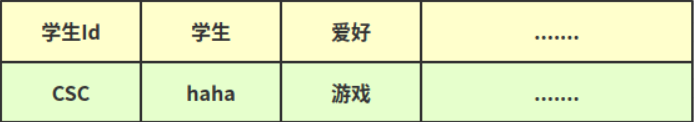

### 反范式

一般说来，数据库只需满足第三范式（3NF）就行了。

没有冗余的数据库设计可以做到。但是，没有冗余的数据库未必是最好的数据库，有时为了提高运行效率，就必须降低范式标准，适当保留冗余数据。具体做法是：在概念数据模型设计时遵守第三范式，降低范式标准的工作放到物理数据模型设计时考虑。降低范式就是增加字段，允许冗余，达到以空间换时间的目的。

### 范式化设计和反范式化设计的优缺点

#### 范式化

- 优点：范式化的表减少了数据冗余，数据表更新操作快、占用存储空间少。
- 缺点：查询时需要对多个表进行关联，查询性能降低。

#### 反范式化

反范式的过程就是通过冗余数据来提高查询性能，但冗余数据会牺牲数据一致性

- 优点：可以减少表关联，可以更好进行索引优化
- 缺点：存在大量冗余数据，数据维护成本更高（删除异常，插入异常，更新异常）

#### OLAP和OLTP中如何设计范式

OLAP 一般冗余比较多，以查询分析为主，这种一般都是采用反范式设计，以提高查询效率。更新一般是定时大批量数据插入。

OLTP 则是尽可能消除冗余，以提高变更的效率。因为这种应用无时无刻不在频繁变化。

## 🍕 缓存设计

一般情况下数据存在数据库中，应用程序直接操作数据库。当应用程序访问量上万，数据库压力突然增大，如果需要减轻数据库服务器的压力，有以下方法：

- 数据库读写分离

- 数据库分库分表

- 使用缓存，并实现换粗你的读写分离

缓存的作用：将应用程序已经访问过的内容或数据存储起来，当应用程序再次访问时先找缓存，缓存命中返回数据。不命中再查询数据库，并保存到缓存。

缓存能够有效地加速应用的读写速度，同时也可以降低后端负载，对日常应用的开发至关重要。

### 设计和使用规范

#### 键值对设计

在Redis中，良好的键值设计可以达成事半功倍的效果，而不好的键值设计可能会带来Redis服务停滞，网络阻塞，CPU使用率飙升等一系列问题，下面来给大家介绍键值对的设计

##### key 命名规范

Redis的Key虽然可以自定义，但最好遵循下面的几个最佳实践约定：

- **遵循基本格式**：`[业务名称]:[数据名]:[id]` 或 `[业务名称]:[数据名]:[id]:[字段名]`

    各个命名域之间一般使用冒号做分割符，这是不成文的规矩。

    例如我们的登录业务，需要保存用户信息，其key可以设计成如下格式：

    ```
    login:user:10
    ```

    或者我们只想保存用户信息的某一个字段，其key可以设计成如下格式：

    ```
    SET login:1:login_times 5 
    SET login:2:login_times 1 
    SET login:3:login_times 2 
    SET login:1:last_login_time 2011-1-1 
    SET login:2:last_login_time 2011-2-1 
    SET login:3:last_login_time 2011-3-1 
    SET login:1:name ”ken thompson“ 
    SET login:2:name “dennis ritchie” 
    SET login:3:name ”Joe Armstrong“
    ```

    这样在已知主键的情况下，通过get、set就可以获得或者修改用户的登录次数和最后登录时间和姓名。
    一般用户是无法知道自己的id的，只知道自己的用户名，所以还必须有一个从name到id的映射关系，这里的设计与上面的有所不同。

    ```
    SET login:ken thompson:id 1 
    SET login:dennis ritchie:id 2 
    SET login: Joe Armstrong:id 3
    ```

    这种设计的好处不仅在于可读性强，还在于可以避免key的冲突问题，而且方便管理

- **Key的长度不超过44字节**

    无论是哪种数据类型， key都是string类型，string类型的底层编码包含int、embstr和raw三种。如果key中全是数字，那么就会直接以int类型去存储，而int占用的空间也是最小的，当然出于业务需求，我们不可能将key设计为一个全数字的，而如果不是纯数字，底层存储的就是SDS内容，如果小于44字节，就会使用embstr类型，embstr在内存中是一段连续的存储空间，内存占用相对raw来说较小，而当字节数大于44字节时，会转为raw模式存储，在raw模式下，内存空间不是连续的，而是采用一个指针指向了另外一段内存空间，在这段空间里存储SDS内容，这样空间不连续，访问的时候性能也就会收到影响，还有可能产生内存碎片

    需要注意的是，如果你的redis版本低于4.0，那么界限是39字节而非44字节

- **Key中不包含一些特殊字符**

    包含空格、换行、单双引号以及其他转义字符

##### value 设计

▐  **拒绝 Big Key ！！！**

BigKey顾名思义就是一个很大的Key，这里的大并不是指Key本身很大，而是指包括这个Key的Value在内的一整个键值对很大

BigKey通常以Key-Value的大小或者Key中成员的数量来综合判定，例如：

- 字符串类型：它的big体现在**单个value值很大**，一般认为超过10KB就是bigkey
- 非字符串类型：哈希、列表、集合、有序集合，它们的big体现在**元素个数太多**

▐  **Big Key 的危害**

- 网络阻塞

    bigkey也就意味着每次获取要产生的网络流量较大，假设一个bigkey为1MB，客户端每秒访问量为1000，那么每秒产生1000MB的流量，对于普通的千兆网卡（按照字节算是128MB/s）的服务器来说简直是灭顶之灾，而且一般服务器会采用单机多实例方式来部署，也就是说一个bigkey可能会对其他实例造成影响，其后果不堪设想。

- 数据倾斜

    集群环境下，由于所有插槽一开始都是均衡分配的，因此BigKey所在的Redis实例内存使用率会远超其他实例，从而无法使数据分片的内存资源达到均衡，最后不得不手动重新分配插槽，增加运维人员的负担

- Redis阻塞

    对元素较多的hash、list、zset等做运算会耗时较久，而且由于Redis是单线程的，在运算过程中会导致服务阻塞，无法接收其他用户请求

- CPU压力

    对BigKey的数据进行序列化或反序列化都会导致CPU的使用率飙升，影响Redis实例和本机其它应用

▐  **Big Key 产生**

一般来说bigkey的产生都是由于程序设计不当，或者对于数据规模预料不清楚造成的，看几个例子：

- 社交类：粉丝列表，如果某些明星粉丝列表设计不当，必会造成bigkey

- 统计类：例如按天存储某项功能或者网站的用户集合，除非没有人用，否则必会bigkey

- 缓存类：将数据从数据库load出来序列化到Redis里，这个方式很常用，但是有两个地方需要注意，第一，是不是有必要吧所有字段都缓存；第二，有没有相关关联的数据，有的人为了方便把很多关联数据都存一个key下，产生了bigkey。

▐  **发现 Big Key**

利用以下命令，可以遍历分析所有key，并返回Key的整体统计信息与每种数据类型中Top1的BigKey

```
redis-cli -a 密码 --bigkeys
```

那么如何判断元素的大小呢？redis中为我们提供了相应的命令，语法如下：

```
memory usage 键名
```

这条命令会返回一条数据占用内存的总大小，这个大小不仅包括Key和Value的大小，还包括数据存储时的一些元信息，因此可能你的Key与Value只占用了几十个字节，但最终的返回结果是几百个字节

但是我们一般不推荐使用memory指令，因为这个指令对CPU的占用率是很高的，实际开发中我们一般只需要衡量Value的大小或者Key中的成员数即可

例如如果我们使用的数据类型是String，就可以使用以下命令，返回的结果是Value的长度

```
strlen 键名
```

如果我们使用的数据类型是List，就可以使用以下命令，返回的结果是List中成员的个数

```
llen 键名
```

▐  **删除 Big Key**

BigKey内存占用较多，因此即便我们使用的是删除操作，删除BigKey也需要耗费很长时间，导致Redis主线程阻塞，引发一系列问题。

如果redis版本在4.0之后，我们可以通过异步删除命令unlink来删除一个BigKey，该命令会先把数据标记为已删除，然后再异步执行删除操作。

如果redis版本在4.0之前，针对集合类型，我们可以先遍历BigKey中所有的元素，先将子元素逐个删除，最后再删除BigKey。至于如何遍历，针对不同的集合类型，可以参考以下不同的命令：

- HSCAN，SCAN，SSCAN，ZSCAN

[命令参考](http://redisdoc.com/index.html)

▐  **优化 Big Key**

找出BigKey中，我们应该如何对BigKey进行优化呢？

- 选择合适的数据类型

    例如：实体类型（要合理控制和使用数据结构，但也要注意节省内存和性能之间的平衡）

    反例：

    ```
    COPYset user:1:name zhangsan
    set user:1:age 20
    set user:1:favor pingpong
    ```

    正例：

    ```
    COPYhmset user:1 name zhangsan age 19 favor pingpong
    ```

- 控制 key 的生命周期

    建议使用expire设置过期时间（条件允许可以打散过期时间，防止集中过期）。

- 拆

    - 字段打散

        将对象的不同属性存储到不同的key中

        | key         | value |
        | ----------- | ----- |
        | user:1:name | Jack  |
        | user:1:age  | 21    |
        
        优点：可以灵活访问对象任意字段
        
        缺点：由于每条数据都会有一些元信息需要存储，因此将一个Key分成多个Key进行存储，占用的内存会变的更大，且由于字段分散，当我们需要做统一控制时会变得很困难
        
    - hash
    
        使用hash结构来存储对象，对象的一个属性对应集合中的一个成员
    
        <table>
            <tr>
            	<td rowspan="2">user:1</td>
                <td>name</td>
                <td>jack</td>
            </tr>
            <tr>
            	<td>age</td>
                <td>21</td>
            </tr>
        </table>

##### 反例

- 反例1：

    ```
    redis> SET registryservice:userid:string:100123 "zhangsan"
    ```

    key 太长，这个key的长度甚至大于value长度，优点是描述信息很明确，缺点就是浪费内存

- 反例2：

    ```
    SET 6B1B0C32-C2C5-4E48-B6BC-DEFA25E41919 "zhangsan"
    ```

    在反例1的基础上，KEY本身是个UUID，缺点：key 太长、含义无可读性，无法scan
- 反例3：
  
  ```
  SET "!@#/:$%^&*()+100123" "zhangsan"
  ```
  
  在反例2的基础上，增加了特殊字符，缺点：无可读性，部分场景下会引发业务异常
  
- 反例4：
  
  ```
  SET "a b c d 100123" "sometext"
  ```
  
  key 中包含了空格，缺点：无可读性，部分场景下引发业务歧义
  

#### 命令使用

1. O(N)命令关注N的数量

    例如：hgetall、Irange、smembers、zrange、sinter等并非不能使用，但是需要明确N的值。有遍历的需求可以使用hscan、sscan、zscan代替。

2. 禁用命令

    禁止线上使用keys、flushall、flushdb等，通过redis的rename机制禁掉命令，或者使用scan的方式渐进式处理。

3. 合理使用select

    redis的多数据库较弱，使用数字进行区分，很多客户端支持较差，同时多业务用多数据库实际还是单线程处理，会有干扰。

4. 使用批量操作提高效率

    ```
    COPY原生命令：例如mget、mset
    非原生命令：可以使用pipeline提高效率
    ```

    但是注意控制一次批量操作的元素个数（例如500以内，实际也和元素字节数有关）。

    注意两者不同：

    ```
    COPY原生命令是原子操作，pipeline是非原子操作。
    pipeline可以打包不同的命令，原生命令做不到
    pipeline需要客户端和服务端同时支持。
    ```

5. Redis事务功能较弱，不建议过多使用，可以用lua替代

#### 客户端使用

- 避免多个应用使用一个 Redis 示例

    不相干的业务拆分，公共数据做服务化。

- 使用带有连接池的数据库，可以有效控制连接，同时提高效率，标准使用方式：

    ```go
    rdb := redis.NewClient(&redis.Options{
    	//连接信息
    	Network:  "tcp",                  //网络类型，tcp or unix，默认tcp
    	Addr:     "127.0.0.1:6379",       //主机名+冒号+端口，默认localhost:6379
    	Password: "",                     //密码
    	DB:       0,                      // redis数据库index
    
    	//连接池容量及闲置连接数量
    	PoolSize:     15, // 连接池最大socket连接数，默认为4倍CPU数， 4 * runtime.NumCPU
    	MinIdleConns: 10, //在启动阶段创建指定数量的Idle连接，并长期维持idle状态的连接数不少于指定数量
    
    	//超时
    	DialTimeout:  5 * time.Second, //连接建立超时时间，默认5秒。
    	ReadTimeout:  3 * time.Second, //读超时，默认3秒， -1表示取消读超时
    	WriteTimeout: 3 * time.Second, //写超时，默认等于读超时
    	PoolTimeout:  4 * time.Second, //当所有连接都处在繁忙状态时，客户端等待可用连接的最大等待时长，默认为读超时+1秒。
    
    	//闲置连接检查包括IdleTimeout，MaxConnAge
    	IdleCheckFrequency: 60 * time.Second, //闲置连接检查的周期，默认为1分钟，-1表示不做周期性检查，只在客户端获取连接时对闲置连接进行处理。
    	IdleTimeout:        5 * time.Minute,  //闲置超时，默认5分钟，-1表示取消闲置超时检查
    	MaxConnAge:         0 * time.Second,  //连接存活时长，从创建开始计时，超过指定时长则关闭连接，默认为0，即不关闭存活时长较长的连接
    
    	//命令执行失败时的重试策略
    	MaxRetries:      0,                      // 命令执行失败时，最多重试多少次，默认为0即不重试
    	MinRetryBackoff: 8 * time.Millisecond,   //每次计算重试间隔时间的下限，默认8毫秒，-1表示取消间隔
    	MaxRetryBackoff: 512 * time.Millisecond, //每次计算重试间隔时间的上限，默认512毫秒，-1表示取消间隔
    
    	//可自定义连接函数
    	Dialer: func() (net.Conn, error) {
    		netDialer := &net.Dialer{
    			Timeout:   5 * time.Second,
    			KeepAlive: 5 * time.Minute,
    		}
    		return netDialer.Dial("tcp", "127.0.0.1:6379")
    	},
    
    	//钩子函数
    	OnConnect: func(conn *redis.Conn) error { //仅当客户端执行命令时需要从连接池获取连接时，如果连接池需要新建连接时则会调用此钩子函数
    		fmt.Printf("conn=%v\n", conn)
    		return nil
    	},
    })
    ```

- 高并发下建议客户端添加熔断功能(例如sentinel、hystrix)

- 设置合理的密码，如有必要可以使用SSL加密访问

#### 注意事项

- 字符串的删除

    非字符串的bigkey，不要使用del删除，使用hscan、sscan、zscan方式渐进式删除（或者使用UNLINK异步非阻塞删除），同时要注意防止bigkey过期时间自动删除问题(例如一个200万的zset设置1小时过期，会触发del操作，造成阻塞）。

- 压缩数据

    如果数据具备良好的压缩效果，一定要压缩数据，避免出现 bigkey。

- 过期设置

    - 建议添加过期时间
    - 避免防止集群过期

### 经典问题

#### 缓存雪崩

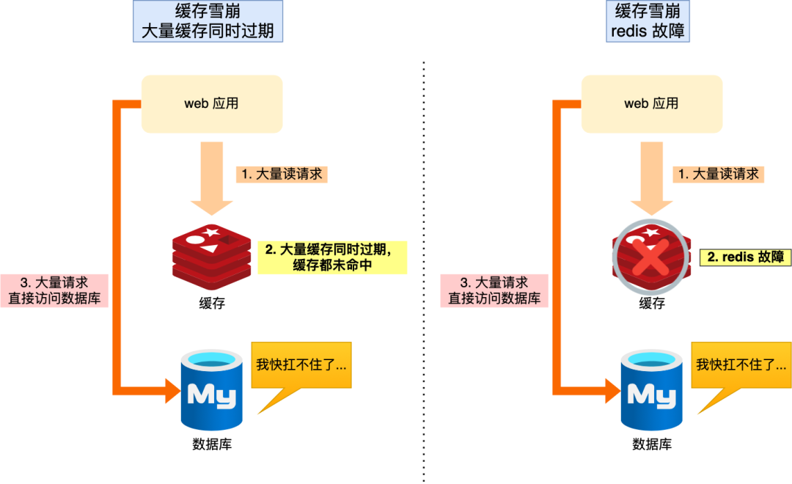

▐  **发生原因**

当**大量缓存数据在同一时间过期（失效）或者 Redis 故障宕机**时，如果此时有大量的用户请求，都无法在 Redis 中处理，于是全部请求都直接访问数据库，从而导致数据库的压力骤增，严重的会造成数据库宕机，从而形成一系列连锁反应，造成整个系统崩溃，这就是**缓存雪崩**的问题。

▐  **解决方案**

针对大量数据同时过期而引发的缓存雪崩问题，常见的应对方法有下面这几种：

- **均匀设置过期时间**

    如果要给缓存数据设置过期时间，应该避免将大量的数据设置成同一个过期时间。我们可以在对缓存数据设置过期时间时，**给这些数据的过期时间加上一个随机数**，这样就保证数据不会在同一时间过期。

- **互斥锁**

    当业务线程在处理用户请求时，**如果发现访问的数据不在 Redis 里，就加个互斥锁，保证同一时间内只有一个请求来构建缓存**（从数据库读取数据，再将数据更新到 Redis 里），当缓存构建完成后，再释放锁。未能获取互斥锁的请求，要么等待锁释放后重新读取缓存，要么就返回空值或者默认值。

    实现互斥锁的时候，最好设置**超时时间**，不然第一个请求拿到了锁，然后这个请求发生了某种意外而一直阻塞，一直不释放锁，这时其他请求也一直拿不到锁，整个系统就会出现无响应的现象。

- **双 key 策略**

    我们对缓存数据可以使用两个 key，一个是**主 key，会设置过期时间**，一个是**备 key，不会设置过期**，它们只是 key 不一样，但是 value 值是一样的，相当于给缓存数据做了个副本。

    当业务线程访问不到「主 key 」的缓存数据时，就直接返回「备 key 」的缓存数据，然后在更新缓存的时候，**同时更新「主 key 」和「备 key 」的数据。**

    双 key 策略的好处是，当主 key 过期了，有大量请求获取缓存数据的时候，直接返回备 key 的数据，这样可以快速响应请求。而不用因为 key 失效而导致大量请求被锁阻塞住（采用了互斥锁，仅一个请求来构建缓存），后续再通知后台线程，重新构建主 key 的数据。

- **后台更新缓存**

    业务线程不再负责更新缓存，缓存也不设置有效期，而是**让缓存“永久有效”，并将更新缓存的工作交由后台线程定时更新**。

    事实上，缓存数据不设置有效期，并不是意味着数据一直能在内存里，因为**当系统内存紧张的时候，有些缓存数据会被“淘汰”**，而在缓存被“淘汰”到下一次后台定时更新缓存的这段时间内，业务线程读取缓存失败就返回空值，业务的视角就以为是数据丢失了。

    解决上面的问题的方式有两种。

    第一种方式，后台线程不仅负责定时更新缓存，而且也负责**频繁地检测缓存是否有效**，检测到缓存失效了，原因可能是系统紧张而被淘汰的，于是就要马上从数据库读取数据，并更新到缓存。

    这种方式的检测时间间隔不能太长，太长也导致用户获取的数据是一个空值而不是真正的数据，所以检测的间隔最好是毫秒级的，但是总归是有个间隔时间，用户体验一般。

    第二种方式，在业务线程发现缓存数据失效后（缓存数据被淘汰），**通过消息队列发送一条消息通知后台线程更新缓存**，后台线程收到消息后，在更新缓存前可以判断缓存是否存在，存在就不执行更新缓存操作；不存在就读取数据库数据，并将数据加载到缓存。这种方式相比第一种方式缓存的更新会更及时，用户体验也比较好。

    在业务刚上线的时候，我们最好提前把数据缓起来，而不是等待用户访问才来触发缓存构建，这就是所谓的**缓存预热**，后台更新缓存的机制刚好也适合干这个事情。

针对 Redis 故障宕机而引发的缓存雪崩问题，常见的应对方法有下面这几种：

- ***服务熔断或请求限流机制***

    因为 Redis 故障宕机而导致缓存雪崩问题时，我们可以启动**服务熔断**机制，**暂停业务应用对缓存服务的访问，直接返回错误**，不用再继续访问数据库，从而降低对数据库的访问压力，保证数据库系统的正常运行，然后等到 Redis 恢复正常后，再允许业务应用访问缓存服务。

    服务熔断机制是保护数据库的正常允许，但是暂停了业务应用访问缓存服系统，全部业务都无法正常工作

    为了减少对业务的影响，我们可以启用**请求限流**机制，**只将少部分请求发送到数据库进行处理，再多的请求就在入口直接拒绝服务**，等到 Redis 恢复正常并把缓存预热完后，再解除请求限流的机制。

- ***构建 Redis 缓存高可靠集群***

    服务熔断或请求限流机制是缓存雪崩发生后的应对方案，我们最好通过**主从节点的方式构建 Redis 缓存高可靠集群**。

    如果 Redis 缓存的主节点故障宕机，从节点可以切换成为主节点，继续提供缓存服务，避免了由于 Redis 故障宕机而导致的缓存雪崩问题。

#### 缓存击穿

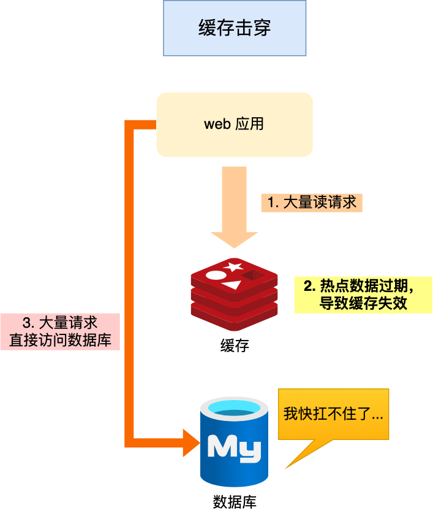

▐  **发生原因**

我们的业务通常会有几个数据会被频繁地访问，比如秒杀活动，这类被频地访问的数据被称为热点数据。

如果缓存中的**某个热点数据过期**了，此时大量的请求访问了该热点数据，就无法从缓存中读取，直接访问数据库，数据库很容易就被高并发的请求冲垮，这就是**缓存击穿**的问题。

▐  **解决方案**

可以发现缓存击穿跟缓存雪崩很相似，你可以认为缓存击穿是缓存雪崩的一个子集。

应对缓存击穿可以采取前面说到两种方案：

- 互斥锁方案，保证同一时间只有一个业务线程更新缓存，未能获取互斥锁的请求，要么等待锁释放后重新读取缓存，要么就返回空值或者默认值。
- 不给热点数据设置过期时间，由后台异步更新缓存，或者在热点数据准备要过期前，提前通知后台线程更新缓存以及重新设置过期时间；

#### 缓存穿透

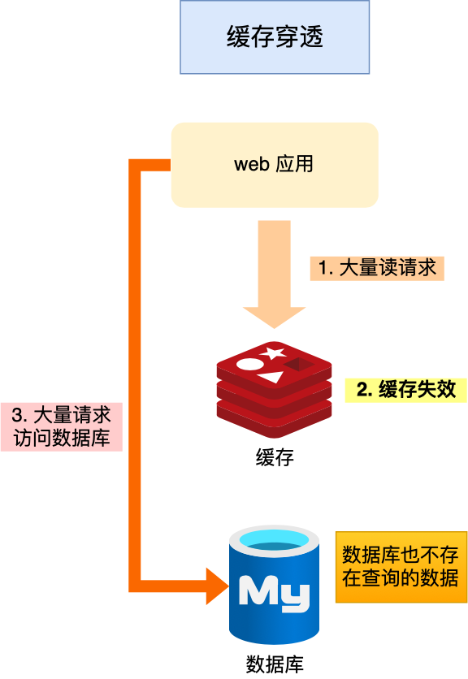

▐  **发生原因**

当发生缓存雪崩或击穿时，数据库中还是保存了应用要访问的数据，一旦缓存恢复相对应的数据，就可以减轻数据库的压力，而缓存穿透就不一样了。

当用户访问的数据，**既不在缓存中，也不在数据库中**，导致请求在访问缓存时，发现缓存缺失，再去访问数据库时，发现数据库中也没有要访问的数据，没办法构建缓存数据，来服务后续的请求。那么当有大量这样的请求到来时，数据库的压力骤增，这就是**缓存穿透**的问题。

▐  **解决方案**

缓存穿透的发生一般有这两种情况：

- 业务误操作，缓存中的数据和数据库中的数据都被误删除了，所以导致缓存和数据库中都没有数据；
- 黑客恶意攻击，故意大量访问某些读取不存在数据的业务；

应对缓存穿透的方案，常见的方案有三种。

- 第一种方案，非法请求的限制；
- 第二种方案，缓存空值或者默认值；
- 第三种方案，使用布隆过滤器快速判断数据是否存在，避免通过查询数据库来判断数据是否存在；

第一种方案，非法请求的限制

当有大量恶意请求访问不存在的数据的时候，也会发生缓存穿透，因此在 API 入口处我们要判断求请求参数是否合理，请求参数是否含有非法值、请求字段是否存在，如果判断出是恶意请求就直接返回错误，避免进一步访问缓存和数据库。

第二种方案，缓存空值或者默认值

当我们线上业务发现缓存穿透的现象时，可以针对查询的数据，在缓存中设置一个空值或者默认值，这样后续请求就可以从缓存中读取到空值或者默认值，返回给应用，而不会继续查询数据库。

*第三种方案，使用布隆过滤器快速判断数据是否存在，避免通过查询数据库来判断数据是否存在。*

我们可以在写入数据库数据时，使用布隆过滤器做个标记，然后在用户请求到来时，业务线程确认缓存失效后，可以通过查询布隆过滤器快速判断数据是否存在，如果不存在，就不用通过查询数据库来判断数据是否存在。

即使发生了缓存穿透，大量请求只会查询 Redis 和布隆过滤器，而不会查询数据库，保证了数据库能正常运行，Redis 自身也是支持布隆过滤器的。

#### 缓存与数据库双写不一致

▐  **发生原因**

缓存是用来加速的，一般不会持久化储存。所以，一份数据通常会存在 DB 和缓存中，由此会带来一个问题，如何保证这两者的数据一致性。另外，缓存热点问题会引入多个副本备份，也可能会发生不一致现象。

▐  **解决方案**

详细见 [分布式之数据库和缓存双写一致性方案解析](https://www.cnblogs.com/rjzheng/p/9041659.html)

## 🔧 实操


## 📒 后记

[如何写出优雅的 Go 语言代码](https://draveness.me/golang-101/)

[go-gin-example](https://github.com/EDDYCJY/go-gin-example/blob/master/README_ZH.md)：一些 Gin 的实践例子

### 一些好的 Web 项目

[gin-vue-admin](https://github.com/flipped-aurora/gin-vue-admin)

[alist](https://github.com/alist-org/alist)

[awesome-gf](https://github.com/gogf/awesome-gf)